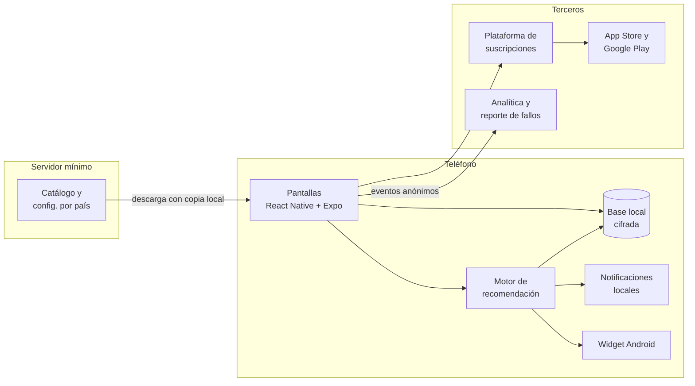
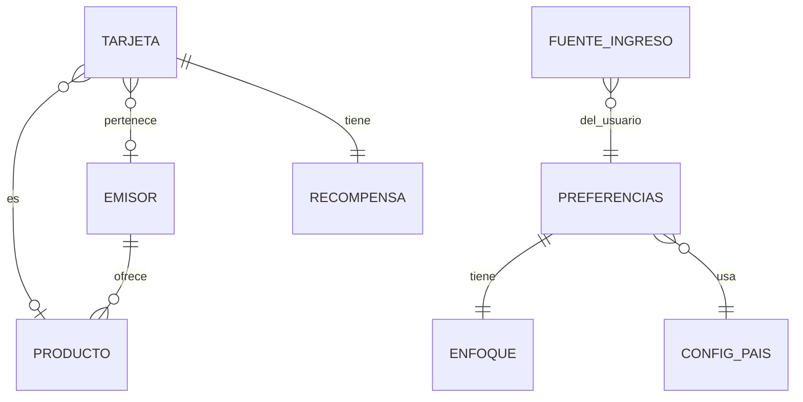

# Tino: documentación técnica

Sep 25, 2026 · @Anderson

## 1. Propósito y fuentes

Este documento traduce la especificación de producto de Tino a decisiones de ingeniería: cómo se estructura el código, qué datos maneja, cómo calcula el motor, cómo se prueba y cómo se publica. La especificación dice qué hace la app; este documento dice cómo se construye. Si ambos se contradicen, manda la especificación y este documento se corrige.

**Fuentes:**

- [Especificación de features de Tino](https://claude.ai/code/artifact/9b4a388e-e9f6-4489-9b39-c93d3c3cb55e), incluida su pestaña "Catálogo de emisores".
- [Maquetas de la pantalla de inicio en modo claro y oscuro](https://claude.ai/artifact/D4pi5Mkn44k2AUs11hZVDB).
- Icono propuesto en SVG y su capa monocromática.
- Archivos del repositorio descritos en la sección 14: tokens de diseño, catálogo de emisores, tipos del modelo de datos, casos de prueba del motor e iconos exportados.

**Alcance:** el MVP (sección 13 de la especificación). Las funciones de v2 y v3 se mencionan solo donde condicionan decisiones de hoy, como el modelo de datos o la estructura del servidor.

## 2. Arquitectura general

Tino es una app que funciona casi por completo en el teléfono. El servidor solo entrega datos públicos (catálogo de emisores y configuración por país) y nunca recibe datos financieros del usuario.



Los datos financieros del usuario viven solo en la base local; hacia afuera salen únicamente eventos anónimos y las compras que gestionan las tiendas.

| Capa | Tecnología | Responsabilidad |
| --- | --- | --- |
| App | React Native con Expo, TypeScript | Pantallas, navegación, estado y lógica de la app |
| Motor | TypeScript puro, sin dependencias de la interfaz | Días de gracia, valor de recompensas, puntaje y ranking; se prueba de forma aislada |
| Datos locales | Base local cifrada; claves en Keychain y Keystore | Tarjetas, ingresos, enfoque, configuración y caché del catálogo |
| Widget | Kotlin en Android (MVP); Swift con WidgetKit en iOS (versión siguiente) | Lee un resumen que la app escribe tras cada recálculo |
| Servidor | Archivos JSON estáticos versionados detrás de una CDN | Catálogo de emisores y configuración por país |
| Terceros | Plataforma de suscripciones, analítica de producto, reporte de fallos | Tino Pro, métricas de la sección 17 de la especificación y estabilidad |

**Decisiones clave:**

- **El motor es un módulo independiente.** No importa nada de React ni de Expo, así se prueba con casos fijos y se puede reutilizar en el servidor o en herramientas web.
- **El servidor no tiene base de datos en el MVP.** El catálogo se publica como archivos JSON estáticos; la app los descarga, verifica la versión y guarda una copia para funcionar sin conexión.
- **Sin cuentas de usuario en el MVP.** La compra de Tino Pro se asocia a la cuenta de la tienda del usuario, no a un registro propio.

## 3. Estructura del proyecto

Un solo repositorio para la app. El motor y los tipos viven en carpetas propias para poder moverlos a un paquete compartido cuando existan las herramientas web.

```text
tino/
  app/                    Pantallas y navegación (Expo Router)
    (tabs)/inicio.tsx       Pantalla de inicio: tarjeta de hoy y ranking
    (tabs)/tarjetas.tsx     Lista y detalle de tarjetas
    (tabs)/ajustes.tsx      Enfoque, ingresos, privacidad, Tino Pro
    onboarding/             Registro inicial en 2 minutos
    tarjeta/[id].tsx        Detalle de tarjeta y semáforo del ciclo
    compra.tsx              Consulta "Tengo una compra"
  src/
    motor/                  Motor de recomendación (TypeScript puro)
      fechas.ts               Cortes, fechas límite, feriados
      recompensas.ts          Valor por cada 1,000
      ranking.ts              Normalización, pesos y penalizaciones
      __tests__/              Pruebas con motor.casos.json
    tipos/tipos.ts          Modelo de datos compartido
    datos/                  Base local cifrada y repositorios
    catalogo/               Descarga, validación y caché del catálogo
    paises/                 Configuración por país (do.json, us.json)
    diseno/                 tokens.json, tipografía y componentes base
    i18n/                   Textos por idioma (es-DO.json)
    analitica/              Eventos permitidos (sección 10)
    notificaciones/         Programación de avisos locales
    suscripciones/          Tino Pro y límite del plan gratis
  widget-android/           Widget nativo en Kotlin (plugin de configuración)
  assets/iconos/            Iconos de tienda y capas adaptativas
  datos-publicos/           emisores-do.json y su esquema (fuente del servidor)
```

**Convenciones:**

- **Navegación** con Expo Router, basada en archivos.
- **Estado:** estado local de React para las pantallas y un almacén ligero para datos globales (tarjetas, enfoque, plan). El ranking nunca se guarda: se recalcula a partir de los datos.
- **Nombres en español** para dominio y archivos (tarjeta, corte, fechaLimite), para que el código hable el mismo idioma que la especificación.
- **Ningún texto visible en el código:** todo sale de los archivos de i18n.
- **Ningún color escrito en las pantallas:** todo sale de los tokens.

## 4. Modelo de datos

El modelo completo está en `src/tipos/tipos.ts` (sección 14). Todas las fechas son cadenas "AAAA-MM-DD" en la zona horaria del usuario, y cada monto va acompañado de su código de moneda.



El usuario tiene preferencias, tarjetas y fuentes de ingreso; el catálogo (emisores y productos) llega del servidor y las tarjetas lo referencian por id.

| Entidad | Campos clave | Reglas |
| --- | --- | --- |
| Tarjeta | alias, emisorId, productoId, diaCorte, fechaLimite, monedaFacturacion, recompensa, enPausa | Nunca guarda el número completo, la fecha de vencimiento ni el CVV. diaCorte 29–31 equivale al último día en meses cortos. En doble balance, fechaLimiteUsd a máximo 5 días de la principal. |
| ReglaFechaLimite | día del mes, o días después del corte | "Día del mes" = primera fecha con ese día posterior al corte. |
| Recompensa | ninguna, puntos (regla y valor del punto) o cashback (%) | Valor del punto precargado en 1.00; valorPuntoConfirmado indica si el usuario lo revisó. |
| FuenteIngreso | frecuencia (semanal, quincenal, cada 2 semanas, mensual, personalizada), ajuste de día no hábil | Las fechas personalizadas pueden ser estimadas. |
| Enfoque | modo y pesos personalizados (Pro, v2) | Los pesos de cada modo están en la sección 5.4. |
| Preferencias | país, idioma, enfoque, pagoBalanceUsd, diferencialCambiarioPct, plan | Diferencial por defecto: 6%. |
| ConfigPais | moneda principal y secundaria, feriados, catalogoDisponible, funciones | Se descarga del servidor; define el modo sin catálogo. |
| Emisor y ProductoTarjeta | grupo, participación, estado de verificación, moneda de facturación y plantilla | Solo lectura en la app. |

**Almacenamiento:** las tarjetas, ingresos y preferencias se guardan en la base local cifrada, con una tabla por entidad y una versión de esquema para migraciones. El catálogo se guarda aparte como caché, con su número de versión.

**Migraciones:** cada cambio de esquema incrementa la versión y trae una función de migración con prueba. Una migración nunca borra datos del usuario.

## 5. Motor de recomendación

El motor es una función pura: recibe `EntradaMotor` (hoy, tarjetas, ingresos, preferencias, país y, opcionalmente, una compra) y devuelve `ResultadoMotor` (ranking, excluidas y pesos aplicados). No guarda nada ni lee la hora del sistema: la fecha de hoy llega como parámetro, para que las pruebas sean reproducibles.

### 5.1 Fechas

1. **Corte en un mes:** el día de corte del mes, o el último día si el mes es más corto (corte 31 en febrero = 28 o 29).
2. **Próximo corte:** si hoy es antes del corte de este mes, ese corte; si hoy es el día del corte, depende de `compraEnDiaDeCorte` (corte actual o del mes siguiente); si ya pasó, el corte del mes siguiente.
3. **Fecha límite nominal:** con "día del mes", la primera fecha con ese día posterior al corte; con "días después del corte", corte + N días.
4. **Ajuste de día no hábil:** si la fecha cae en sábado, domingo o feriado del país, se mueve al día hábil anterior (`adelantar`), al siguiente (`atrasar`) o se deja igual (`ninguno`).
5. **Días de gracia** = fecha de pago − hoy, en días de calendario. **Días para el corte** = próximo corte − hoy.

En compras en dólares con tarjetas de doble balance se usa `fechaLimiteUsd` si existe.

### 5.2 Valor de las recompensas

Se calcula sobre el monto de referencia del país (1,000) en el ranking de hoy, o sobre el monto de la compra en "Tengo una compra".

| Tipo | Valor |
| --- | --- |
| Puntos por monto | monto ÷ porCadaMonto × puntos × valor del punto |
| Puntos por porcentaje | monto × porcentaje ÷ 100 × valor del punto |
| Puntos por transacción | puntos × valor del punto; solo en "Tengo una compra" |
| Cashback | monto × porcentaje ÷ 100 |

En compras en dólares se usa `recompensaUsd` si la tarjeta la tiene.

### 5.3 Exclusiones y penalizaciones

| Regla | Condición | Efecto |
| --- | --- | --- |
| En pausa | `enPausa` | Se excluye del ranking |
| Solo uso local | Compra en dólares y tarjeta `solo_local` | Se excluye del ranking |
| Corte cercano | Días para el corte ≤ 3 (configurable) | −10 puntos y etiqueta `corta_pronto` |
| Vence antes del cobro | Hay ingresos registrados y ningún cobro entre hoy y la fecha de pago | −15 puntos y etiqueta `vence_antes_del_cobro` |
| Conversión cambiaria | Compra en dólares, usuario paga con dólares y tarjeta que factura solo en pesos | −(diferencial × 10) puntos, máximo 100 (6% → −60) |

La penalización por conversión está calibrada para que un diferencial de 6% pese más que cualquier diferencia típica de recompensas (1% a 5%).

### 5.4 Puntaje y orden

```latex
\text{puntaje} = \sum_{d \in \{\text{días, puntos, cashback}\}} \frac{\text{peso}_d}{100} \times \frac{\text{valor}_d}{\max(\text{valor}_d)} \times 100 - \text{penalizaciones}
```

- **Pesos del MVP** (días / puntos / cashback): Liquidez 80/10/10, Puntos 20/70/10, Cashback 20/10/70, Equilibrado 40/30/30.
- **Dimensiones inactivas:** si ninguna tarjeta candidata tiene valor en una dimensión, su peso se reparte proporcionalmente entre las demás.
- **Orden:** puntaje de mayor a menor; en empate, más días de gracia; luego alias en orden alfabético.
- **Control de enfoque:** la pantalla de inicio ordena siempre por el puntaje del enfoque guardado; el orden por valor bruto de una dimensión (`ordenarRanking`) queda en el motor pero no se muestra (decisión D30 de `docs/progreso.md`).

### 5.5 Semáforo del ciclo

Con el corte anterior y el próximo: **rojo** si faltan 3 días o menos para el corte; **verde** si transcurrió menos de un tercio del ciclo; **amarillo** en cualquier otro caso.

### 5.6 Implementación

```typescript
export function calcularRanking(e: EntradaMotor): ResultadoMotor {
  const candidatas = e.tarjetas.filter(t => !excluir(t, e));   // 5.3
  const medidas = candidatas.map(t => medir(t, e));             // 5.1 y 5.2
  const pesos = pesosActivos(e.preferencias.enfoque, medidas);  // 5.4
  return ordenar(medidas.map(m => puntuar(m, pesos, e)));      // 5.4 y 5.5
}
```

### 5.7 Casos de prueba

`src/motor/__tests__/motor.casos.json` contiene 17 casos con entrada y resultado esperado, generados con una implementación de referencia de estas reglas. La implementación en TypeScript debe reproducir cada resultado exactamente, con puntajes redondeados a 2 decimales.

| Caso | Qué verifica |
| --- | --- |
| Ejemplo 7.4, modos Equilibrado, Liquidez y Puntos | Orden C, B, A en Equilibrado (66.8, 58.0, 47.5); en Liquidez C sigue primero por poco (83.6 frente a 82.5); en Puntos gana B |
| Corte 31 en febrero | Corte el 28 de febrero de 2027 y pago el 20 de marzo |
| Compra en día de corte | 51 días si entra al siguiente estado; 20 días y semáforo rojo si entra al actual |
| Fin de semana y feriado | Los tres modos de ajuste y un feriado de prueba |
| En pausa, una tarjeta, sin recompensas | Exclusión, ranking de un elemento y redistribución de pesos (100/0/0) |
| Corte cercano y vence antes del cobro | Penalizaciones y etiquetas con nómina quincenal 15 y 30 |
| Compras en dólares | Tarjeta solo local excluida; penalización de conversión solo si el usuario paga con dólares |

**Nota para la especificación:** el ejemplo 7.4 usa meses de 30 días; con fechas reales los días de gracia son 46, 35 y 50 en lugar de 45, 34 y 50, sin cambiar el orden.

## 6. Almacenamiento, seguridad y privacidad

| Aspecto | Implementación |
| --- | --- |
| Base local | SQLite en el dispositivo con cifrado de la base completa; la clave se genera al instalar y se guarda en el almacén seguro del sistema (Keychain en iOS, Keystore en Android) |
| Bloqueo | Biometría o PIN al abrir la app y al volver después de 1 minuto en segundo plano (configurable) |
| Vista previa del sistema | Al pasar a segundo plano se cubre la pantalla, para que los montos no aparezcan en el selector de apps recientes |
| Datos que nunca se piden | Número completo de tarjeta, fecha de vencimiento, CVV, usuario o clave del banco |
| Validación | El campo "últimos 4 dígitos" acepta exactamente 4 números; cualquier campo de texto rechaza secuencias de 13 a 19 dígitos, para evitar guardar un número completo por error |
| Datos que salen del teléfono | Solo eventos anónimos de analítica (sección 10), reportes de fallos sin datos personales y las compras que gestiona la tienda |
| Respaldo en la nube | Fuera del MVP (v2); se cifrará en el teléfono antes de subir |
| Exportar y borrar | Ajustes permite exportar los datos en un archivo y borrarlo todo, incluida la clave de cifrado |
| Permisos | Notificaciones al terminar el onboarding; ningún otro permiso en el MVP |

**Ley 172-13:** la política de privacidad explica en lenguaje simple qué se guarda en el teléfono, qué eventos anónimos se envían y cómo desactivarlos. La app no crea perfiles personales ni vende datos.

## 7. Servicios externos y servidor

### 7.1 Servidor de datos públicos

En el MVP el servidor es un conjunto de archivos JSON estáticos detrás de una CDN; no hay base de datos ni cuentas.

| Archivo | Contenido | Actualización |
| --- | --- | --- |
| `/v1/paises/index.json` | Lista de países con su versión de configuración y de catálogo | Con cada cambio |
| `/v1/paises/do.json` | `ConfigPais` de RD: monedas, feriados del año, funciones activas | Anual (feriados) o cuando cambie una regla |
| `/v1/catalogos/do.json` | `Catalogo` de RD (emisores-do.json) | Cuando se agreguen emisores o productos; se revisa con cada listado nuevo de la Superintendencia de Bancos |

**Flujo en la app:**

1. Al abrir, si pasaron más de 24 horas desde la última revisión, descarga `index.json`.
2. Si la versión del catálogo o del país cambió, descarga el archivo, lo valida contra su esquema y reemplaza la caché local solo si la validación pasa.
3. Sin conexión, o si la descarga falla, sigue usando la caché. La app incluye una copia de ambos archivos para funcionar desde la primera apertura sin internet.
4. Si una tarjeta referencia un emisor o producto que ya no existe en el catálogo, conserva sus datos y se muestra como "Otro".

### 7.2 Terceros

| Servicio | Uso | Requisito |
| --- | --- | --- |
| Plataforma de suscripciones (por ejemplo, RevenueCat) | Tino Pro: compra, restauración, prueba de 30 días y estado del plan | Compatible con Expo; unifica App Store y Google Play |
| Analítica de producto (por ejemplo, PostHog o Amplitude) | Eventos anónimos y cohortes de la sección 17 de la especificación | Identificador anónimo, sin datos personales; se desactiva desde Ajustes |
| Reporte de fallos (por ejemplo, Sentry) | Errores y cierres inesperados | Sin datos de tarjetas en los reportes |
| Notificaciones | Avisos locales programados en el teléfono | En el MVP no hay notificaciones desde servidor |
| EAS (Expo) | Compilación, firma, publicación y actualizaciones directas | Ver sección 12 |

La elección final de cada proveedor se documenta aquí antes de la etapa 6 del plan (sección 13), comparando costo, cumplimiento de privacidad y compatibilidad con Expo.

## 8. Sistema de diseño e iconos

### 8.1 Tokens

`src/diseno/tokens.json` contiene la paleta Jade y oro (sección 16.5 de la especificación) en tres niveles:

- **Base:** los 14 colores con nombre (jadeTino, oro, coralClaro, tinta…).
- **Semántico por modo:** `claro` y `oscuro` con los mismos nombres de rol (fondo, superficie, texto, primario, destacado, recompensaTexto, alertaTexto, semaforoRojo…). Las pantallas solo usan estos roles, nunca los colores base.
- **Tipografía, espacios, radios y área mínima de toque (44 puntos).**

El tema activo sigue la configuración del sistema; un hook `useTema()` devuelve los roles del modo actual.

### 8.2 Tipografía

| Uso | Familia | Nota |
| --- | --- | --- |
| Títulos y cifras (días de gracia) | Bricolage Grotesque, 600 y 700 | Cifras grandes y con carácter |
| Texto | Atkinson Hyperlegible Next, 400, 600 y 700 | Diseñada para distinguir números y letras parecidas |

Ambas se cargan con el sistema de fuentes de Expo y se incluyen en la app, no se descargan en tiempo de uso. Todos los tamaños escalan con el tamaño de texto del sistema.

### 8.3 Componentes base

| Componente | Uso | Referencia visual |
| --- | --- | --- |
| TarjetaDestacada | La tarjeta de hoy: días de gracia, fecha de pago, recompensa y semáforo | Maquetas de inicio |
| FilaTarjeta | Cada tarjeta del ranking con días, fecha y etiquetas | Maquetas de inicio |
| Etiqueta | Recompensa (oro), alerta (coral), neutra | Maquetas de inicio |
| ControlEnfoque | Control segmentado con los modos de enfoque; guarda al tocar | Maquetas de inicio |
| Semaforo | Punto de color más texto ("Buen momento", "Espera") | Sección 3.4 de la especificación |
| Hoja | Hojas deslizables para enfoque, detalle y consulta de compra | — |
| BotonPrimario | Acción principal en jade con texto de contraste | — |

Las [maquetas de la pantalla de inicio](https://claude.ai/artifact/D4pi5Mkn44k2AUs11hZVDB) son la referencia de espaciado y jerarquía de la primera pantalla.

### 8.4 Iconos

| Archivo | Uso | Formato |
| --- | --- | --- |
| `assets/iconos/app-store-1024.png` | Icono de App Store y de iOS | 1024×1024, sin transparencia, sin esquinas redondeadas |
| `assets/iconos/play-store-512.png` | Ficha de Google Play | 512×512 |
| `assets/iconos/android-fondo.png` | Icono adaptativo: capa de fondo | 432×432 (108 dp a 4x) |
| `assets/iconos/android-primer-plano.png` | Icono adaptativo: tarjetas y sello, dentro de la zona segura de 66 dp | 432×432 con transparencia |
| `assets/iconos/android-monocromo.png` | Iconos temáticos de Android 13 en adelante | 432×432 con transparencia |
| `assets/iconos/fuente-icono.svg` | Fuente vectorial para futuras exportaciones | SVG |

En `app.json`: `icon` apunta al PNG de 1024; `android.adaptiveIcon` usa `foregroundImage`, `backgroundImage` y `monochromeImage` con los archivos de Android. Las variantes oscura y tintada de iOS se agregan antes del lanzamiento a partir del SVG fuente.

## 9. Internacionalización y configuración por país

La base multipaís (sección 18 de la especificación) se implementa con tres piezas:

| Pieza | Archivo | Qué define |
| --- | --- | --- |
| Configuración por país | `src/paises/do.json` (tipo `ConfigPais`) | Monedas principal y secundaria, idiomas, feriados, catálogo disponible, funciones activas (doble balance) y monto de referencia |
| Textos | `src/i18n/es-DO.json` | Todos los textos visibles; el código solo usa claves (`inicio.titulo`, `etiqueta.cortaPronto`) |
| Catálogo | `datos-publicos/emisores-do.json` (tipo `Catalogo`) | 40 emisores de RD en dos grupos, con participación y estado de verificación |

**Reglas:**

- El país se detecta por la región del teléfono en el onboarding y se puede cambiar en Ajustes.
- Un país sin archivo de catálogo usa el modo sin catálogo: banco y producto opcionales, en texto libre.
- `funciones.dobleBalance: false` oculta la moneda de facturación "Pesos y dólares" y la pregunta sobre cómo paga su balance en dólares.
- Fechas, montos y monedas se formatean con las APIs de internacionalización del sistema, según el idioma y país (por ejemplo, "RD$1,000" y "25 de septiembre").
- Los feriados de `do.json` están vacíos en esta versión: hay que completarlos con el calendario oficial del año, incluidos los traslados que dispone la ley, antes de la etapa 2.

**Agregar un país:** crear `paises/xx.json`, el archivo de idioma si cambia la variante, publicar ambos en el servidor y, si hay demanda suficiente (sección 18.4 de la especificación), su catálogo.

## 10. Analítica

La analítica implementa la sección 17 de la especificación. Toda la lógica pasa por un único módulo, `src/analitica/`, que es el único lugar del código que puede enviar eventos.

**Reglas de implementación:**

- **Lista cerrada de eventos:** el módulo expone una función por evento (`registrarTarjetaRegistrada(...)`), con tipos que solo aceptan las propiedades permitidas. No existe una función genérica para enviar eventos libres.
- **Rangos, nunca valores:** el número de tarjetas se envía como "1", "2", "3-4" o "5+"; la duración del onboarding, en rangos de 30 segundos. Los montos nunca se envían.
- **Identificador anónimo** aleatorio por instalación, reiniciable desde Ajustes.
- **Interruptor de privacidad:** con la analítica desactivada, el módulo descarta los eventos sin enviarlos ni guardarlos.
- **País en cada evento,** para las métricas por país de la sección 18.
- **Prueba automática:** una prueba recorre todos los eventos con datos de ejemplo y falla si alguna propiedad contiene 13 a 19 dígitos seguidos, un monto o un alias escrito por el usuario.

| Evento | Propiedades permitidas |
| --- | --- |
| onboarding\_completado | duración (rango), tarjetas (rango), ingresos registrados (sí o no) |
| tarjeta\_registrada | emisorId u "otro", productoId u "otro", moneda de facturación, tipo de recompensa |
| inicio\_visto | modo de enfoque, tarjetas (rango) |
| orden\_cambiado | orden elegido |
| enfoque\_cambiado | modo anterior, modo nuevo |
| consulta\_compra | moneda de la compra (sin monto) |
| widget\_visto | plataforma |
| sugerencia\_mostrada, sugerencia\_aceptada, sugerencia\_descartada | tipo de dato sugerido |
| muro\_pago\_visto | motivo (3.ª tarjeta, función avanzada) |
| prueba\_iniciada, suscripcion\_iniciada, suscripcion\_cancelada | plan; vienen de la plataforma de suscripciones |

Las ofertas (`oferta_vista`, `oferta_reportada`) se agregan en v2, junto con las promociones.

## 11. Pruebas y calidad

| Nivel | Qué se prueba | Herramienta | Cuándo se ejecuta |
| --- | --- | --- | --- |
| Unitarias del motor | Los 17 casos de `motor.casos.json`, más casos nuevos por cada error encontrado | Jest | En cada cambio |
| Unitarias de módulos | Catálogo (validación y caché), migraciones de datos, cálculo de fechas de cobro, analítica sin datos personales | Jest | En cada cambio |
| Componentes | TarjetaDestacada, FilaTarjeta, Semaforo y Etiqueta en modo claro y oscuro, con texto grande | React Native Testing Library | En cada cambio |
| Flujos completos | Onboarding, registro de tarjeta, cambio de enfoque, límite del plan gratis, compra de Pro en entorno de prueba | Maestro, en emulador de Android | Antes de cada versión |
| Manual en teléfonos reales | iPhone (por TestFlight) y un Android de gama media | Lista de verificación | Antes de cada versión |

**Lista de verificación antes de cada versión:**

- [ ] Todas las pruebas automáticas pasan.
- [ ] La tarjeta de hoy aparece en menos de 2 segundos en el Android de gama media.
- [ ] Modo claro y oscuro revisados en inicio, registro y ajustes.
- [ ] Texto del sistema al máximo sin cortes ni superposiciones.
- [ ] Un lector de pantalla anuncia el semáforo y las etiquetas en palabras.
- [ ] La app funciona sin conexión desde la primera apertura.
- [ ] Ningún evento de analítica contiene datos personales ni montos.
- [ ] Los criterios de aceptación del MVP de la especificación (secciones 14.1, 15.5, 16.6 y 18.6) están cubiertos.

**Regla del motor:** cualquier cambio en las reglas de la sección 5 actualiza primero `motor.casos.json` con la implementación de referencia y después el código, nunca al revés.

## 12. Compilación y publicación con EAS

Todo el ciclo se hace sin Mac, con los servicios de Expo (EAS).

| Perfil | Uso | Distribución |
| --- | --- | --- |
| `development` | Versión de desarrollo instalada una vez en el teléfono; los cambios de código llegan al instante | Interna: enlace de instalación en Android, dispositivo registrado en iOS |
| `preview` | Versión de prueba para validar antes de publicar | TestFlight en iOS; prueba interna de Google Play |
| `production` | Versión para las tiendas | App Store y Google Play |

**Pasos para la primera versión:**

1. Crear las cuentas de Apple Developer y Google Play Console, y el proyecto en Expo.
2. Configurar `app.json` con nombre "Tino", identificador de paquete, iconos (sección 8.4), idioma y permisos.
3. Dejar que EAS genere y administre los certificados y perfiles de firma de Apple.
4. Compilar con `eas build --profile preview` para ambas plataformas y probar en teléfonos reales.
5. Publicar con `eas submit` en TestFlight y en la prueba interna de Google Play.
6. Completar las fichas de las tiendas con los textos de la sección 1.1 de la especificación, capturas y política de privacidad.
7. Publicar la versión `production` después de la lista de verificación de la sección 11.

**Actualizaciones directas:** los cambios que solo tocan JavaScript (textos, correcciones del motor, diseño) se publican con `eas update` sin pasar por revisión de las tiendas. Los cambios nativos (widget, nuevos permisos, librerías nativas) requieren una compilación nueva. Cada actualización directa se publica primero en el canal `preview`.

**Widget de iOS:** se agrega en una versión posterior (sección 16.3 de la especificación), con una Mac alquilada en la nube para depurarlo.

**Versionado:** versión visible con formato mayor.menor.corrección (1.0.0), y número de compilación que EAS incrementa automáticamente.

## 13. Plan de desarrollo por etapas

Cada etapa termina con algo que funciona en el teléfono y se puede probar. Las historias usan el formato "como usuario quiero… para…" y se cierran con los criterios de aceptación de la especificación indicados.

| Etapa | Objetivo | Historias principales | Criterios de la especificación | Listo cuando |
| --- | --- | --- | --- | --- |
| 1. Base | Proyecto que compila y corre en ambos teléfonos | Crear proyecto Expo con TypeScript y Expo Router; cargar tokens, fuentes y tema claro y oscuro; base local cifrada con migraciones; configuración por país y textos de i18n; iconos | 16.6 (contraste, modos), 18.6 (país como configuración) | La app abre en iOS y Android con una pantalla vacía que respeta el tema y el país |
| 2. Motor | Motor completo y probado | Implementar fechas, recompensas, penalizaciones, puntaje y semáforo; pasar los 17 casos | 14.1 (días en meses de 28 a 31, valor de puntos) | `npm test` pasa todos los casos del motor |
| 3. Registro de tarjetas | Registrar tarjetas en 30 segundos | Catálogo con caché y copia incluida; selector de banco y producto con "Otro" y "No sé el tipo"; fechas, moneda de facturación y recompensas; pregunta de pago en dólares; interruptor En pausa | 14.1 (registro sin bloqueos), 4.3 (reglas del doble balance) | Se registran 3 tarjetas en menos de 2 minutos |
| 4. Pantalla de inicio | La tarjeta de hoy al abrir | TarjetaDestacada, ranking, control de enfoque, semáforo, modo una tarjeta, detalle de tarjeta, consulta "Tengo una compra" | 14.1 (reordenar sin cambiar el enfoque, modo una tarjeta) | La pantalla coincide con las maquetas y cambia con el enfoque |
| 5. Ingresos y avisos | Avisos útiles sin montos | Frecuencias de cobro; etiqueta y alerta "Vence antes de tu cobro"; notificaciones de cambio de tarjeta, fecha límite y resumen mensual; sugerencias de datos | 14.1 (frecuencias durante 12 meses, alerta por fechas) | Las notificaciones llegan en las fechas correctas en pruebas con fechas simuladas |
| 6. Pro, analítica y lanzamiento | Publicar en las tiendas | Tino Pro con prueba de 30 días y límite de 2 tarjetas; analítica y reporte de fallos; widget de Android; fichas de tiendas; lista de verificación | 15.5, 17 (eventos sin datos personales) | Versión 1.0.0 aprobada en App Store y Google Play |

**Orden sugerido:** las etapas 1 y 2 van primero porque todo depende de ellas. La 3 y la 4 pueden avanzar juntas una vez listo el motor. La 5 y la 6 cierran el MVP.

## 14. Archivos del repositorio

El paquete `tino-repo.zip` contiene los archivos iniciales, en las rutas de la sección 3.

| Archivo | Contenido | Estado |
| --- | --- | --- |
| `README.md` | Índice de los archivos | Listo |
| `src/tipos/tipos.ts` | Modelo de datos completo del MVP (sección 4) | Listo |
| `src/motor/__tests__/motor.casos.json` | 17 casos de prueba con resultados esperados (sección 5.7) | Listo |
| `herramientas/motor-referencia/motor.py` y `generar_casos.py` | Implementación de referencia del motor y generador de casos | Listo |
| `src/diseno/tokens.json` | Paleta por modo, tipografía, espacios y radios (sección 8) | Listo |
| `src/i18n/es-DO.json` | Textos iniciales de inicio, orden, enfoque, semáforo, registro y Pro | Inicial: crece con cada pantalla |
| `src/paises/do.json` | Configuración de RD | Feriados por completar |
| `datos-publicos/emisores-do.json` | 40 emisores con grupo, participación y verificación | Productos por completar, empezando por el grupo 1 |
| `assets/iconos/` | App Store, Google Play, capas del icono adaptativo y SVG fuente | Listo; faltan variantes oscura y tintada de iOS |

**Pendientes de datos antes del lanzamiento:**

- Feriados oficiales del año en `do.json`.
- Productos de tarjeta y recompensas de los emisores del grupo 1, y verificación de los 7 marcados "por verificar".
- Resultado de la búsqueda de marcas de "Tino" (sección 1.1 de la especificación): si obliga a cambiar el nombre, cambian `app.json`, los textos de i18n y las fichas de tienda, no el código.
