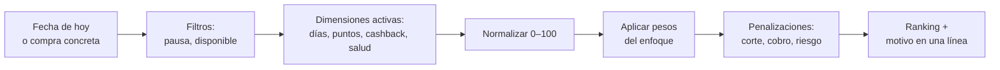
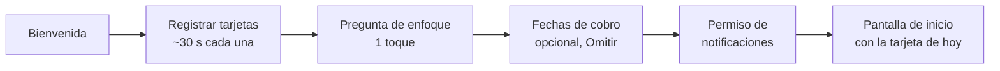

# Tino - Qué tarjeta de crédito usar: especificación de features

Sep 24, 2026 · @Anderson

## 1. Resumen del producto

Al abrir Tino, el usuario ve qué tarjeta de crédito usar hoy según la fecha actual y el enfoque que configuró: más días para pagar, más puntos, más cashback o un equilibrio. La app funciona desde el primer minuto con solo fechas y reglas de recompensa, y sus recomendaciones mejoran a medida que el usuario agrega más datos financieros.

**Problema.** Quien tiene 2 o más tarjetas rara vez sabe cuál le da más días de financiamiento hoy, cuál le genera más puntos o cashback, ni si podrá pagar a tiempo con su próximo ingreso. El resultado son intereses evitables, recompensas desaprovechadas y pagos tardíos.

**Propuesta de valor.**

- Respuesta inmediata: la tarjeta de hoy en la pantalla de inicio y en el widget, sin escribir nada.
- Hasta 45–50 días de financiamiento sin intereses usando la tarjeta correcta el día correcto.
- Más puntos o cashback por el mismo gasto, según las reglas que el usuario registre.
- Menos pagos tardíos: avisos cuando una fecha límite cae antes de su próximo cobro.

**Visión: más datos, mejores recomendaciones.** La app nunca obliga a ingresar datos más allá de lo mínimo. Cada dato adicional (ingresos, balances, límites, gastos fijos, tasas) activa una función nueva o hace más precisa una existente, y la app sugiere en el momento oportuno qué completar y qué gana el usuario al hacerlo (sección 2).

**Imparcialidad.** El ranking de Tino no se vende: ningún banco ni comercio puede pagar para mejorar la posición de una tarjeta (sección 15.1).

**Usuario objetivo.** Persona asalariada o trabajador independiente, con 1 a 6 tarjetas de crédito, que quiere optimizar sin llevar hojas de cálculo.

**Fuera de alcance.** La app no realiza pagos, no solicita tarjetas nuevas y no almacena el número completo, la fecha de vencimiento ni el CVV de ninguna tarjeta.

### 1.1 Nombre y presencia en tiendas

La app se llama **Tino**. En español y en portugués, "tino" significa acierto o buen juicio: la app con tino para elegir tarjeta. Se eligió como marca global porque se pronuncia igual en los idiomas principales (TI-no), es corta, no tiene significados negativos conocidos en esos idiomas y evita el territorio de nombres con "card", "kart" o "tempo", saturado por competidores y otras fintech. El nombre de trabajo anterior era Tarjetino. El mercado inicial es República Dominicana.

El nombre no explica por sí solo qué hace la app; lo explica el subtítulo, adaptado por idioma en cada tienda.

| Campo | Tienda | Idioma | Texto | Caracteres |
| --- | --- | --- | --- | --- |
| Nombre | App Store | Todos | Tino | 4 / 30 |
| Subtítulo | App Store | Español | Qué tarjeta de crédito usar | 27 / 30 |
| Subtítulo | App Store | Inglés | Best card to use today | 22 / 30 |
| Subtítulo | App Store | Portugués | Qual cartão usar hoje | 21 / 30 |
| Título | Google Play | Español | Tino: Qué tarjeta usar | 22 / 30 |
| Descripción corta | Google Play | Español | Descubre qué tarjeta de crédito usar hoy para tener más días, puntos o cashback. | 80 / 80 |
| Palabras clave | App Store | Español | corte, fecha límite, puntos, cashback, millas, pago, quincena, recordatorio, crédito, dólares | Menos de 100 |

- No se usan nombres de bancos en palabras clave ni en textos de la tienda, para evitar conflictos de marca.
- Eslogan: "La tarjeta correcta, cada día" (en inglés, "The right card, every day").
- Nombres descartados por conflicto: Cardo (app competidora con el mismo concepto), Cardino (demasiado parecido a Cardo), la familia Karty, Karta y Kartoo, la familia Tempo y TempoPay, y Kairo (búsquedas dominadas por El Cairo).
- Pendiente antes del lanzamiento: búsqueda de marcas en las clases 9 (software) y 36 (servicios financieros) en ONAPI, USPTO, EUIPO y la base mundial de la OMPI; dominio disponible (por ejemplo, gettino.com, tinoapp.com o usetino.com); usuarios en redes sociales; búsqueda en App Store y Google Play de apps financieras con el mismo nombre; y prueba de pronunciación y connotaciones con hablantes nativos de inglés, portugués y francés. Si Tino no pasa la búsqueda de marcas, la alternativa es un nombre inventado.
- Opcional: registrar también "Tarjetino" en ONAPI como marca de reserva para RD.

## 2. Datos progresivos: más datos, mejores recomendaciones

La app organiza los datos en cuatro niveles. Cada nivel es opcional salvo el primero, y la app le muestra al usuario qué gana al completar el siguiente.

| Nivel | Qué ingresa el usuario | Qué obtiene | Fase |
| --- | --- | --- | --- |
| 1. Esencial | Por tarjeta: banco y producto (de un catálogo), día de corte, fecha límite, tipo de recompensa y su tasa (puntos con valor del punto, o % de cashback) | Tarjeta de hoy, orden por días, puntos y cashback, días de gracia de cada tarjeta, recordatorios de pago | MVP |
| 2. Ingresos | Fechas de cobro: semanal, quincenal, mensual o personalizadas (sección 5) | Etiqueta "Vence antes de tu cobro", alerta de pago por fechas, preferencia por tarjetas que se pagan después del cobro | MVP (opcional) |
| 3. Balances | Monto del estado de cuenta (total y mínimo) una vez por ciclo, límite de crédito y montos de ingreso | Crédito disponible, utilización, alerta de pago por montos, dimensión "salud" en los pesos | v2 |
| 4. Finanzas completas | Gastos fijos, suscripciones, tasas de interés, cuota anual, multiplicadores por categoría, promociones, compras con "La usé" | Proyección de saldo día a día, plan de deudas, calculadora de intereses, rentabilidad de cada tarjeta, recomendación por comercio | v2–v3 |

### 2.1 Indicador de precisión

Un indicador en Ajustes y en el detalle de cada tarjeta muestra qué tan completa está la información, por ejemplo "Precisión de recomendaciones: 60%". Se calcula por los datos llenos de cada nivel, con más peso en los que más cambian la recomendación (valor del punto, fechas de cobro, balance).

### 2.2 Sugerencias para completar datos

La app sugiere completar datos de forma contextual, nunca como un formulario largo ni como un bloqueo.

- **En el momento en que el dato aporta.** Ejemplo: al acercarse una fecha límite, "Agrega tus fechas de cobro y te avisamos si este pago vence antes de que cobres".
- **Con el beneficio explícito.** Cada sugerencia dice qué función se activa o qué mejora, nunca solo "completa tu perfil".
- **Un dato por vez.** Cada sugerencia pide un solo dato o una sola pantalla, completable en menos de 30 segundos.
- **Con límite de frecuencia.** Máximo una sugerencia por semana; si el usuario la descarta dos veces, esa sugerencia no se repite durante 60 días.
- **Con transparencia en el ranking.** Si falta un dato que afecta la recomendación, la fila de la tarjeta lo indica: "Sin valor del punto: comparación de puntos aproximada".

| Dato que falta | Cuándo se sugiere | Mensaje de ejemplo |
| --- | --- | --- |
| Valor del punto | Al registrar una tarjeta con puntos | "¿Cuánto vale 1 punto al canjearlo? Sin este dato no podemos comparar puntos con cashback" |
| Fechas de cobro | Primera fecha límite próxima | "Dinos cuándo cobras y te avisamos si un pago vence antes" |
| Estado de cuenta | Al día siguiente de cada corte | "La Visa A acaba de cortar. ¿Cuánto debes pagar? Te avisaremos si tu ingreso no alcanza" |
| Límite de crédito | Tras 2 semanas de uso | "Agrega el límite y evitaremos recomendarte una tarjeta llena" |
| Gastos fijos | Tras registrar ingresos y balances | "Agrega tus gastos fijos para calcular cuánto te queda realmente para pagar" |
| Multiplicadores por categoría | Si la tarjeta tiene puntos y el usuario usa "Tengo una compra" | "¿Esta tarjeta da más puntos en supermercados o restaurantes?" |

## 3. Pantalla de inicio: la tarjeta de hoy

Al abrir la app, sin tocar nada, el usuario ve qué tarjeta usar hoy y cuántos días de gracia le da cada una. La respuesta aparece en menos de 2 segundos y no requiere escribir montos.

### 3.1 Estructura

- **Tarjeta destacada.** La mejor opción de hoy, en grande, con el motivo en una línea: "50 días para pagar · 1.5 puntos por cada 100".
- **Control de enfoque.** Botones de un toque con los modos de enfoque: Equilibrado · Días · Puntos · Cashback (sección 6). Tocar uno cambia el enfoque guardado y recalcula la tarjeta de hoy y la lista al instante. Un ícono de información junto al título de la lista explica que cada enfoque combina días y recompensas con distinta prioridad.
- **Lista de tarjetas.** Cada fila muestra lo que se detalla en la tabla 3.2.
- **Franja de próximo pago.** Al pie, la fecha límite más cercana y, si hay nivel 3, su monto.
- **Sugerencia de datos.** Como máximo una tarjeta discreta de sugerencia (sección 2.2), que se puede descartar.

**Control de enfoque (con 2 o más tarjetas).** Es el único control de orden de la pantalla de inicio: no hay un orden temporal aparte, porque dos controles con las mismas palabras ("Puntos") confundían y el orden por un solo dato ignoraba las penalizaciones (por ejemplo, subía una tarjeta que corta mañana). El enfoque elegido también lo usan el widget y las notificaciones, y el motivo de la tarjeta destacada lo nombra ("Tu mejor opción para acumular puntos"). Los modos con balances (Reducir deuda) y los perfiles personalizados de Pro se agregan al mismo control o a Ajustes cuando existan. Con una sola tarjeta el control se oculta (sección 3.5).

### 3.2 Información por tarjeta en la lista

| Dato | Ejemplo | Nivel requerido |
| --- | --- | --- |
| Alias y últimos 4 dígitos | Visa Oro ·4821 | 1 |
| Días de gracia si se usa hoy | 50 días | 1 |
| Fecha en que se pagaría una compra de hoy | 25 de noviembre | 1 |
| Días para el próximo corte | Corta en 12 días | 1 |
| Rendimiento por cada 1,000 gastados | 15 puntos (≈ 15.00) o 10.00 de cashback | 1 |
| Etiqueta de estado | Corta en 2 días · Vence antes de tu cobro · En pausa · Tope alcanzado | 1–2 |
| Crédito disponible y utilización | 117,600 disponible · 22% | 3 |

### 3.3 Comportamiento

- El ranking se recalcula automáticamente cada día a las 00:00 y al abrir la app.
- Puntos y cashback se comparan como tasa por cada 1,000 gastados, por eso no hace falta un monto.
- El botón "Tengo una compra" abre la consulta con monto y categoría para una recomendación exacta (sección 7.5).
- Tocar una tarjeta abre su detalle: fechas del ciclo, reglas de recompensa, beneficios vigentes, interruptor "En pausa" y botón opcional "La usé".
- El interruptor "En pausa" saca la tarjeta del ranking (por ejemplo, si está llena o se está pagando), sin pedir montos.
- El mismo contenido resumido alimenta el widget (sección 11).

### 3.4 Semáforo del ciclo

Cada tarjeta tiene un semáforo que indica si es buen momento para usarla en compras grandes o que se pueden mover:

| Color | Momento del ciclo | Mensaje de ejemplo |
| --- | --- | --- |
| Verde | Primer tercio del ciclo, justo después del corte | "Buen momento: esta compra se paga en 48 días" |
| Amarillo | Mitad del ciclo | "Se paga en 33 días" |
| Rojo | Últimos días antes del corte | "Si puedes, espera al día 6: pasarías de 21 a 50 días" |

Se muestra en el detalle de cada tarjeta y es el centro del modo una tarjeta.

### 3.5 Modo una tarjeta

Con una sola tarjeta registrada no hay ranking que mostrar, así que la pantalla de inicio cambia de "¿qué tarjeta?" a "¿es buen momento?":

- El semáforo del ciclo en grande, con los días de gracia de hoy y la fecha en que se pagaría una compra de hoy.
- La próxima fecha límite y, con ingresos registrados, si cae antes del cobro.
- Las ofertas vigentes de esa tarjeta (sección 9, desde v2).
- Una invitación discreta: "¿Tienes otra tarjeta? Agrégala y te diremos cuál conviene cada día".

El control de enfoque se oculta hasta que haya una segunda tarjeta.

## 4. Datos de la tarjeta

Para aparecer en la pantalla de inicio, una tarjeta necesita banco, producto, día de corte y fecha límite; la recompensa se pide en la misma pantalla. Registrar una tarjeta toma unos 30 segundos.

### 4.1 Fechas y datos básicos (nivel 1)

| Campo | Obligatorio | Ejemplo | Uso |
| --- | --- | --- | --- |
| Banco emisor | Sí | Banco X | Filtra promociones, precarga reglas del banco (feriados, compra el día del corte) |
| Producto (tipo de tarjeta) | Sí | Visa Gold | Filtra las promociones que aplican a esa tarjeta, precarga días de gracia y recompensas típicas |
| Alias | Sí (sugerido automáticamente) | "Visa Gold Banco X" | Identificación en la app |
| Día de corte | Sí | 5 | Cálculo de días de gracia |
| Fecha límite de pago | Sí | Día 25, o corte + 20 días | Días de gracia y recordatorios |
| Últimos 4 dígitos | No | 4821 | Diferenciar tarjetas iguales |

**Banco y producto se eligen de un catálogo** con logos y buscador, en dos toques (anexo: catálogo de emisores). Al elegirlos, la app precarga los datos típicos del producto y sugiere el alias, así que el registro queda más corto que escribir todo a mano. Un ícono informativo junto a ambos campos explica por qué se piden: *"Lo usamos para mostrarte solo las promociones de tu tarjeta y precargar sus fechas y beneficios. Nunca pedimos el número de tu tarjeta ni tus datos del banco."*

Dos salidas evitan bloquear el registro:

- **"Mi tarjeta no está en la lista":** se registra el banco y el producto queda como "Otro". La tarjeta funciona igual en el ranking.
- **"No sé el tipo":** se muestran todas las promociones del banco con la nota "puede no aplicar a tu tarjeta".

Cada elección de "Otro" o de un banco sin catálogo se registra de forma anónima para decidir qué emisores y productos agregar.

En países sin catálogo (sección 18), banco y producto son opcionales y se escriben a mano; la tarjeta funciona igual en el ranking.

### 4.2 Recompensas (nivel 1)

El usuario elige el tipo de recompensa: puntos, cashback o ninguna. Una tarjeta sin recompensa participa en el ranking solo por días.

**Puntos.** La app acepta tres formas de regla, porque cada banco lo expresa distinto:

| Tipo de regla | Qué ingresa el usuario | Ejemplo |
| --- | --- | --- |
| Por monto | Puntos por cada X gastado | 1 punto por cada 100 |
| Por porcentaje | Porcentaje de la compra en puntos | 2% de la compra en puntos |
| Por transacción | Puntos fijos por uso | 10 puntos por compra |

El **valor del punto** (cuánto vale 1 punto al canjearlo) se pide junto con la regla, precargado con 1.00 y editable. Sin él la app no puede comparar puntos contra cashback; si el usuario no lo cambia, la fila muestra "comparación aproximada" hasta que lo confirme.

**Cashback.** Porcentaje general de devolución (ejemplo: 1%).

### 4.3 Moneda de facturación y compras en dólares (nivel 1, MVP)

El MVP soporta tarjetas con doble balance desde el registro, porque son comunes y cambian cómo se paga y cómo conviene usar la tarjeta.

- **Moneda principal.** Por ahora es el peso dominicano (DOP) para todos los usuarios, sin selección en el onboarding. Más monedas podrán agregarse en el futuro. Toda la app se muestra en ella, incluidos el valor del punto y el rendimiento "por cada 1,000".
- **Moneda de facturación por tarjeta.** Reemplaza al antiguo interruptor de doble balance. Se precarga desde el catálogo de productos y el usuario puede corregirla. Hay cuatro opciones:

| Opción | Qué significa | Compras en dólares |
| --- | --- | --- |
| Solo pesos | Uso local e internacional; todo se factura en pesos | Se convierten a pesos al comprar |
| Pesos y dólares (doble balance) | Dos balances: lo comprado en dólares se factura en dólares | Van al balance en dólares |
| Solo dólares | Todo se factura en dólares | Se facturan en dólares; las compras en pesos se convierten |
| Solo uso local | No acepta compras internacionales | Se excluye de las compras en dólares |

- **Doble balance.** La moneda secundaria es siempre el dólar (USD). Ambos balances comparten el día de corte; la fecha límite es la misma por defecto y se puede separar por moneda si el banco las distingue.
- **Recompensas por moneda.** Por defecto, las mismas reglas para ambas monedas. Si el banco da puntos o cashback distintos en compras en dólares, se registran aparte.
- **Pantalla de inicio.** Las tarjetas con doble balance llevan la etiqueta "Pesos y dólares", y el recordatorio menciona ambos pagos: "Paga los dos balances de la Visa A antes del 25". Las de solo dólares llevan la etiqueta "Dólares" y las de solo uso local, "Local".
- **"Tengo una compra".** Incluye selector de moneda (pesos o dólares). En compras en dólares aplica las reglas de conversión descritas abajo.
- **Modelo de datos.** Cada monto se guarda con su código de moneda estándar (DOP, USD, EUR), para agregar más monedas sin rehacer la base de datos.

**Reglas del doble balance.** Una tarjeta con doble balance es un solo plástico y una sola cuenta, por eso:

1. Es **una sola entrada en el ranking** y cuenta como una tarjeta para el límite del plan gratis.
2. El balance secundario **comparte el día de corte**, sin excepción.
3. Si se separa la fecha límite por moneda, debe estar **a máximo 5 días de la principal**, como ocurre en los bancos reales.

Estas reglas impiden registrar una segunda tarjeta como "balance en dólares" de otra; aun así, hacerlo no daría ventaja, porque esa tarjeta nunca aparecería como opción propia en el ranking.

**Compras en dólares y costo de conversión.** En los tarifarios revisados de bancos dominicanos no hay un cargo aparte por compras en dólares: el costo está en la tasa de cambio. Quien paga en pesos un balance en dólares lo hace a la tasa de venta del banco, y quien tiene dólares y usa una tarjeta solo en pesos debe vender sus dólares a la tasa de compra para pagar. Con tasas publicadas por un banco grande en septiembre de 2026, ese diferencial entre compra y venta rondaba el 6–7%.

Por eso la app no usa un cargo fijo. Al registrar la primera tarjeta con dólares (doble balance o solo dólares) pregunta una sola vez: *"¿Con qué pagas tu balance en dólares?"*

| Respuesta | Regla en compras en dólares |
| --- | --- |
| Con pesos | Sin penalización: todas las tarjetas convierten a tasas parecidas y compiten solo por días, puntos y cashback |
| Con dólares | Las tarjetas que facturan solo en pesos reciben una penalización igual al diferencial compra-venta: 6% como valor inicial en el MVP, editable en Ajustes; en v2 se calcula con las tasas publicadas por el banco del usuario |

En cualquier caso, las tarjetas de solo uso local se excluyen de las compras en dólares, para no recomendar una tarjeta que será rechazada. Las compras en otras monedas (por ejemplo, euros) quedan fuera del MVP; la app solo muestra una nota de que suelen llevar un margen adicional de cambio (en un banco revisado, 3%).

Los montos por moneda (total y mínimo de cada balance) y la tasa de cambio para sumar ambos balances llegan con el nivel 3 (sección 4.5).

### 4.4 Recompensas avanzadas (nivel 4)

- Multiplicadores por categoría: 3x en restaurantes, 2% de cashback en supermercados.
- Multiplicadores por comercio o día: doble puntos los viernes en el comercio Y.
- Tope de puntos o cashback por periodo; al alcanzarlo, la tarjeta deja de sumar en esa dimensión.
- Monto mínimo por compra para generar recompensa.
- Exclusiones: avances de efectivo, pagos de impuestos, recargas.
- Vencimiento de puntos y saldo de puntos actual.
- Beneficios fijos (seguros, salones VIP) solo informativos.

### 4.5 Balances (nivel 3)

| Campo | Frecuencia | Uso |
| --- | --- | --- |
| Monto del estado de cuenta: total y mínimo | Una vez por ciclo, sugerido tras el corte | Alerta de pago por montos, franja de próximo pago |
| Límite de crédito | Una vez | Disponible, utilización, filtro de tarjeta llena |
| Montos por moneda | Una vez por ciclo | Total y mínimo de cada balance en tarjetas con doble balance; tasa de cambio para sumarlos (manual o automática) |

### 4.6 Costos (nivel 4)

- Tasa de interés anual por moneda.
- Pago mínimo como porcentaje del balance o monto fijo.
- Cuota anual y mes en que se cobra.
- Cargo por pago tardío y por avance de efectivo.

## 5. Ingresos

El registro de fechas de cobro es opcional en el MVP y se ofrece en el onboarding con un botón "Omitir" visible. En el MVP solo se piden fechas; los montos llegan con el nivel 3.

### 5.1 Frecuencias soportadas

| Frecuencia | Qué configura el usuario | Ejemplo |
| --- | --- | --- |
| Semanal | Día de la semana | Cada viernes |
| Quincenal por días fijos | Dos días del mes | Días 15 y 30 |
| Cada 2 semanas | Día de la semana y una fecha de referencia | Viernes por medio, desde el 4 de septiembre |
| Mensual | Un día del mes, o "último día hábil" | Día 28 |
| Personalizada (independientes) | Fechas específicas o esperadas, una por una o repetidas | Cobro de cliente A los días 10; cobros de proyectos con fecha estimada |

Un usuario puede registrar varias fuentes de ingreso a la vez (por ejemplo, nómina quincenal y un trabajo independiente).

### 5.2 Reglas de las fechas

- **Día no laborable.** Si el cobro cae en fin de semana o feriado, se adelanta o se atrasa según lo que elija el usuario.
- **Meses cortos.** Un cobro el día 30 o 31 se toma como el último día del mes cuando el mes es más corto.
- **Ingresos variables.** Para independientes, cada fecha puede marcarse como "confirmada" o "estimada". Las fechas estimadas generan avisos más prudentes: "Si tu cobro del 10 se retrasa, esta tarjeta vence antes".
- **Confirmación de cobro (opcional).** El día de cobro, la app puede preguntar "¿Ya cobraste?" para ajustar avisos si el pago se retrasó.

### 5.3 Qué activa en el MVP

- Etiqueta "Vence antes de tu cobro" en la lista cuando la fecha límite de una compra hecha hoy cae antes del siguiente cobro.
- Alerta de pago por fechas: "Tu Visa vence el 12 y cobras el 15; aparta el dinero antes".
- En el modo "Recomendado", una penalización leve a las tarjetas cuyo pago cae justo antes de un cobro, y una ventaja a las que se pagan pocos días después.

### 5.4 Montos (nivel 3)

Monto fijo por cobro, o rango mínimo–máximo para ingresos variables. Con montos, la alerta pasa de "fechas" a "montos" (sección 8).

## 6. Enfoque parametrizable

El usuario elige qué optimiza la app, y el orden "Recomendado" de la pantalla de inicio se calcula con ese enfoque. En el onboarding se elige con una sola pregunta ("¿Qué prefieres: más días, más puntos, más cashback o un equilibrio?"), y se puede cambiar en cualquier momento desde el selector de enfoque de la pantalla de inicio (con 2 o más tarjetas, sección 3.1) o desde Ajustes.

### 6.1 Modos predefinidos con datos completos (nivel 3 o superior)

Con balances registrados, el motor usa cuatro dimensiones: días, puntos, cashback y salud.

| Modo | Qué prioriza | Pesos (días / puntos / cashback / salud) | Ideal para |
| --- | --- | --- | --- |
| Liquidez | Mayor número de días para pagar | 70 / 10 / 10 / 10 | Quien necesita estirar el flujo de caja |
| Puntos | Mayor valor en puntos por compra | 15 / 65 / 10 / 10 | Quien acumula para viajes o canjes |
| Cashback | Mayor devolución en dinero | 15 / 10 / 65 / 10 | Quien prefiere ahorro directo |
| Equilibrado (por defecto) | Mezcla de todo | 35 / 25 / 25 / 15 | La mayoría de usuarios |
| Reducir deuda | Evitar tarjetas con balance alto o tasa alta | 20 / 5 / 5 / 70 | Quien está pagando deudas |

"Salud" agrupa la utilización de crédito y la tasa de interés de cada tarjeta: penaliza usar una tarjeta cercana a su límite o con tasa alta.

### 6.2 Modos en el MVP (niveles 1 y 2)

Sin balances, la dimensión "salud" no se puede calcular. Su peso se redistribuye y el modo "Reducir deuda" queda oculto hasta que el usuario registre balances; la app lo sugiere entonces (sección 2.2).

| Modo | Pesos (días / puntos / cashback) |
| --- | --- |
| Liquidez | 80 / 10 / 10 |
| Puntos | 20 / 70 / 10 |
| Cashback | 20 / 10 / 70 |
| Equilibrado (por defecto) | 40 / 30 / 30 |

Al pasar al nivel 3, la app cambia a los pesos de la tabla 6.1 y avisa: "Ahora tus recomendaciones también cuidan tu utilización de crédito".

### 6.3 Modo personalizado (v2)

- Controles deslizantes por dimensión activa que siempre suman 100%.
- Vista previa en vivo: al mover un control, el ranking de hoy se reordena en pantalla.
- Varios perfiles guardados con nombre (ejemplo: "Mes normal" y "Temporada de viaje").

### 6.4 Reglas que se aplican en cualquier modo

Estas reglas filtran o penalizan tarjetas antes de ordenar, y se activan según los datos disponibles:

| Regla | Efecto | Nivel |
| --- | --- | --- |
| En pausa | La tarjeta sale del ranking | 1 |
| Corte muy cercano | Penalización y etiqueta "Corta en N días" | 1 |
| Vence antes de tu cobro | Penalización leve y etiqueta | 2 |
| Disponible insuficiente | Se descarta si la compra supera el disponible | 3 |
| Umbral de utilización | Penalización al superar el umbral configurable (30% por defecto) | 3 |
| Pago en riesgo por montos | Penalización fuerte si la compra caería en un pago que el ingreso no cubre | 3–4 |
| Regla manual por categoría | "Supermercado siempre con la tarjeta X"; tiene prioridad sobre el cálculo | v2 |

## 7. Motor de recomendación

El motor ordena las tarjetas con las dimensiones que los datos del usuario permiten calcular, y suma dimensiones y reglas a medida que hay más datos. Trabaja en dos modos: el ranking de hoy (sin monto, en la pantalla de inicio) y la consulta "Tengo una compra" (con monto y categoría).



Cada tarjeta pasa por filtros, se mide en las dimensiones activas, se pondera con los pesos del enfoque y recibe penalizaciones antes de ordenarse.

### 7.1 Días de gracia

```latex
\text{días} = (\text{próximo corte} - \text{hoy}) + (\text{fecha límite} - \text{fecha de corte})
```

- Compra el mismo día del corte: se configura por banco si entra en el estado actual o en el siguiente; por defecto, en el siguiente.
- Fecha límite en fin de semana o feriado: se ajusta según la regla del banco (se adelanta, se atrasa o no cambia).
- Corte el día 29, 30 o 31: en meses más cortos se toma el último día del mes.

### 7.2 Valor de las recompensas

```latex
\text{valor puntos} = \text{puntos generados} \times \text{multiplicador} \times \text{valor del punto}
```

Los puntos generados dependen del tipo de regla: monto ÷ X, monto × %, o un número fijo por transacción. En la pantalla de inicio se calcula sobre 1,000 como monto de referencia; la regla por transacción se muestra aparte ("+10 puntos por uso") porque no depende del monto. El cashback es monto × % de cashback. Con topes registrados, una tarjeta que alcanzó su tope vale 0 en esa dimensión.

### 7.3 Puntaje

```latex
\text{puntaje} = \sum_{d \in \text{activas}} \text{peso}_d \times \text{normalizado}_d - \text{penalizaciones}
```

Cada dimensión se normaliza de 0 a 100 entre las tarjetas candidatas (la mejor recibe 100), para que días y dinero sean comparables. Si ninguna tarjeta tiene cashback, esa dimensión se desactiva y su peso se reparte entre las demás.

### 7.4 Ejemplo

Hoy es día 6 del mes, modo Equilibrado del MVP (40 / 30 / 30), rendimiento por cada 1,000:

| Tarjeta | Corte / límite | Días de gracia hoy | Recompensa | Valor por 1,000 | Normalizado (días / puntos / cashback) | Puntaje | Posición |
| --- | --- | --- | --- | --- | --- | --- | --- |
| C | Día 1 / día 21 | 45 | 1% cashback | 10.00 en cashback | 90 / 0 / 100 | 66 | 1.ª |
| B | Día 20 / día 10 | 34 | 2% en puntos, punto = 1.00 | 20.00 en puntos | 68 / 100 / 0 | 57 | 2.ª |
| A | Día 5 / día 25 | 50 | 1 punto por cada 100, punto = 0.50 | 5.00 en puntos | 100 / 25 / 0 | 48 | 3.ª |

En Equilibrado gana C porque combina buenos días con recompensa. En Liquidez C sigue primero por poco frente a A (50 días), y en Puntos pasa B (20.00 por cada 1,000). La tarjeta destacada explica el motivo: "C: 45 días y 10.00 de cashback por cada 1,000". Si el usuario registró que cobra el día 8, B no recibe penalización, porque su pago del día 10 cae después del cobro.

### 7.5 Consulta "Tengo una compra" y simulador

- **Consulta.** El usuario escribe monto y categoría (y comercio, en v3). El motor aplica multiplicadores, topes, mínimos por compra y disponible (las promociones no entran al cálculo; si hay una vigente, se muestra como nota, sección 9.1), y devuelve el ranking exacto con el botón "La usé".
- **Simulador de compra grande (v2, nivel 3).** Muestra el efecto de la compra en el disponible, la utilización y los próximos pagos.

## 8. Flujo de caja y alertas de pago

Las alertas de pago crecen con los datos: en el MVP comparan fechas, con balances comparan montos, y con finanzas completas proyectan el saldo día a día.

| Tipo de alerta | Nivel | Qué compara | Mensaje de ejemplo |
| --- | --- | --- | --- |
| Recordatorio | 1 | Solo la fecha límite | "La Visa A vence en 3 días" |
| Por fechas | 2 | Fecha límite contra próximo cobro | "Tu Visa vence el 12 y cobras el 15; aparta el dinero antes" |
| Por montos | 3 | Monto a pagar contra ingreso y colchón | Ver niveles de la tabla 8.1 |
| Proyección | 4 | Saldo día a día con gastos fijos y suscripciones | "El 12 tu saldo proyectado queda en −3,500" |

### 8.1 Niveles de la alerta por montos (nivel 3)

| Nivel | Condición | Mensaje de ejemplo |
| --- | --- | --- |
| Aviso | Cubres el total, pero quedas bajo el colchón configurado | "Pagarás la Visa, pero te quedarán solo 2,000 hasta tu cobro del 30" |
| Riesgo | Cubres el mínimo, no el total | "Solo alcanzas a pagar el mínimo de la Visa del día 12" |
| Crítico | No cubres ni el mínimo | "No podrás cubrir el mínimo de la Visa del día 12. Actúa ahora" |

Cada alerta ofrece acciones concretas: mover gastos futuros a una tarjeta cuyo pago cae después del cobro, pagar una parte ahora, ver el costo en intereses de pagar solo el mínimo (nivel 4), o marcarla como resuelta.

### 8.2 Gastos fijos (nivel 4)

Por defecto se pide un solo número, "¿Cuánto gastas al mes en fijos?", más un colchón mínimo que el usuario quiere conservar. El detalle por gasto, con monto y día del mes, es opcional y mejora la proyección diaria.

### 8.3 Calendario unificado (v2)

Una vista de calendario con cortes, fechas límite, cobros y, si existen, gastos fijos y saldo proyectado bajo cada día. Los días en rojo son los que tienen saldo proyectado negativo.

## 9. Promociones y beneficios

**Fase: v2, fuera del MVP.** La curaduría de promociones es el costo operativo más alto de la app (trabajo humano continuo por banco y por país). Dejarla para v2 permite lanzar con costos mínimos y hace que el MVP funcione igual en cualquier país. Las promociones se activan en v2 solo en los países donde el ingreso neto cubra su curaduría (sección 17.3), empezando por los 3 bancos principales de RD. Todo lo que sigue en esta sección describe cómo funcionarán en v2.

Las promociones de los bancos (descuentos y devoluciones en comercios específicos o en fechas determinadas) se muestran **solo como información**, filtradas por las tarjetas que el usuario tiene registradas. **El ranking no las toma en cuenta**: sigue calculándose únicamente con fechas, recompensas base y el enfoque configurado. Así, un dato mal extraído (un tope, una fecha, un producto) nunca puede llevar a una mala recomendación, y la imparcialidad del ranking queda a la vista.

### 9.1 Dónde aparecen

- **"Ofertas en tus tarjetas".** Sección propia con las promociones vigentes de las tarjetas registradas, ordenadas por fecha de fin. Filtros por categoría y por tarjeta.
- **Detalle de cada tarjeta.** Lista de sus promociones vigentes.
- **Nota en "Tengo una compra".** Si hay una promoción vigente para ese comercio o categoría, se muestra una nota sin tocar el puntaje: "Ojo: tu Mastercard B tiene 15% en este comercio hasta el domingo". El usuario decide.
- **Notificación semanal opcional.** "Esta semana tus tarjetas tienen 3 ofertas nuevas", con límite de frecuencia.

Para evitar que el ranking y las ofertas parezcan contradecirse, la pantalla de inicio presenta el ranking como **"Recomendación del día"** (general) y las promociones siempre bajo **"Ofertas"** (específicas por comercio).

### 9.2 Reglas de visualización

- Solo se muestran promociones de productos que el usuario tiene. Con producto "No sé el tipo", se muestran las del banco con la nota "puede no aplicar a tu tarjeta".
- Cada promoción muestra sus condiciones clave (tope, monto mínimo, días, canal presencial o en línea), un enlace a la fuente oficial y la nota "verifica condiciones con tu banco".
- Botón "Reportar un error" en cada promoción; una promoción con varios reportes se oculta hasta revisarla.
- Las promociones vencen solas en su fecha de fin.
- Las patrocinadas llevan la etiqueta "Patrocinado" (sección 15.4).

### 9.3 Estandarización de la información

Cada promoción, venga de donde venga, se traduce a un esquema único:

| Grupo | Campos | Ejemplo |
| --- | --- | --- |
| Quién | Banco, productos de tarjeta que aplican | Banco X: Visa Gold y Visa Platinum |
| Dónde | Comercio (ID canónico) o categoría | Comercio Y, todas las tiendas |
| Cuándo | Fecha de inicio y fin, días de la semana, horario | 11 al 15 de junio; o todos los viernes |
| Qué da | Tipo de beneficio y valor | 15% de devolución |
| Límites | Monto mínimo, tope por transacción, tope por periodo, máximo de usos | Mínimo 1,000; tope 600; 4 usos al mes |
| Condiciones | Canal, moneda, requiere inscripción, acumulable con la recompensa base | Solo presencial, no acumulable |
| Control | Fuente oficial, fecha de captura, confianza, estado de revisión | PDF de términos, revisada |

La normalización se apoya en cuatro catálogos mantenidos por Tino: **comercios** (un ID por comercio con sus variantes de nombre), **categorías** (taxonomía propia alineada con los códigos de categoría de comercio de Visa y Mastercard), **productos de tarjeta** (el mismo catálogo del registro) y **tipos de beneficio** (descuento inmediato, devolución, puntos multiplicados, monto fijo por tramo, cuotas sin intereses).

Aunque no entran al ranking, cada promoción guarda su **tasa efectiva** para mostrarla con claridad: un 10% con tope de 600 en una compra de 8,000 equivale a 7.5%.

```latex
\text{tasa efectiva} = \frac{\min(\text{porcentaje} \times \text{monto},\ \text{tope})}{\text{monto}}
```

**Proceso de publicación:**

1. **Captura:** páginas de promociones y PDF de términos de los bancos, portal para bancos y comercios, y reportes de usuarios ("Vi una promoción").
2. **Extracción con IA** al esquema, marcando los campos dudosos.
3. **Validación automática:** fechas coherentes, porcentajes razonables, campos obligatorios, comercio y producto encontrados en los catálogos.
4. **Puntaje de confianza:** alto, revisión rápida; bajo, revisión humana completa. Nada se publica sin revisión.
5. **Publicación con versión:** historial por promoción, vencimiento automático y nueva revisión si la fuente cambia.

Antes de automatizar la captura se revisan los términos de uso de cada sitio. El portal para bancos y comercios es gratuito: publicar no cuesta; lo que se cobra es destacar (sección 15.4).

### 9.4 Posible inclusión futura en el ranking

Mientras sean informativas se mide la calidad de los datos: porcentaje de promociones reportadas como incorrectas o vencidas. Si esa tasa se mantiene baja durante varios meses, se puede ofrecer en Pro, como opción que el usuario activa, que las promociones entren al cálculo de "Tengo una compra". Si no, se quedan como informativas.

### 9.5 Otros beneficios

- **Seguimiento de topes** de puntos o cashback de la recompensa base, con aviso al 80% y al 100% (v2).
- **Puntos por vencer**, con aviso 30 días antes y su valor estimado (v2).
- **Rentabilidad de la tarjeta (v3):** lo ganado en el año contra cuota anual e intereses.
- **Detección por ubicación (v3):** al entrar a un comercio con una oferta en las tarjetas del usuario, una notificación informativa. Requiere permiso explícito.

## 10. Salud financiera y deuda

Estas funciones, disponibles desde el nivel 3, evitan que optimizar días y puntos empuje al usuario a endeudarse más.

- **Utilización de crédito (nivel 3).** Porcentaje usado por tarjeta y total, con semáforo: verde menos de 30%, amarillo 30–50%, rojo más de 50%. Umbrales configurables.
- **Calculadora del pago mínimo (nivel 4).** Meses y costo en intereses de pagar solo el mínimo, frente a pagar el total.
- **Plan de salida de deudas (nivel 4).** Métodos avalancha (primero la tasa más alta) y bola de nieve (primero el saldo más pequeño), con fecha estimada y ahorro en intereses de cada uno.
- **Modo "Reducir deuda".** Se activa en el enfoque (sección 6) cuando hay balances.
- **Resumen de salud mensual.** Pagos a tiempo, utilización promedio e intereses pagados en el mes.

El interruptor "En pausa" (nivel 1) cubre la necesidad básica sin datos: una tarjeta que se está pagando no aparece en el ranking.

## 11. Notificaciones y widget

El MVP tiene tres notificaciones y el widget; el resto se agrega con los datos y las fases. Todas se pueden activar, desactivar y ajustar desde Ajustes.

| Notificación | Cuándo (por defecto) | Nivel | Fase |
| --- | --- | --- | --- |
| Cambio de mejor tarjeta: "Desde hoy, usa la Visa A (50 días)" | El día después de cada corte | 1 | MVP |
| Fecha límite próxima | 3 días antes | 1 | MVP |
| Vence antes de tu cobro | 5 días antes de la fecha límite | 2 | MVP |
| Sugerencia de datos (sección 2.2) | Contextual, máximo 1 por semana | 1–4 | MVP |
| Estado de cuenta: "¿Cuánto debes pagar?" | Al día siguiente del corte | 3 | v2 |
| Alerta por montos (aviso, riesgo, crítico) | En cuanto se detecta | 3 | v2 |
| Confirmación de pago | El día límite | 3 | v2 |
| Tope de beneficios | Al 80% y 100% | 4 | v2 |
| Puntos por vencer | 30 días antes | 4 | v2 |
| Resumen: días aprovechados, puntos y cashback ganados | Mensual | 1–4 | MVP |
| Cuota anual y rentabilidad | 30 días antes del cobro | 4 | v3 |

**Widget (MVP en Android; en iOS, versión siguiente, sección 16.3).** Muestra la tarjeta recomendada hoy con sus días de gracia, la tarjeta a evitar y la próxima fecha límite. Es la principal defensa contra el abandono, porque da la respuesta sin abrir la app.

**Suscripciones (v2, nivel 4).** El usuario registra sus cargos automáticos y la app sugiere en qué tarjeta cargar cada uno según su día de cobro y el enfoque.

## 12. Captura de datos, seguridad y privacidad

El MVP funciona solo con datos ingresados por el usuario, sin ningún dato recurrente obligatorio. Las integraciones automáticas llegan después para reducir el esfuerzo de los niveles 3 y 4.

### 12.1 Métodos de captura

| Método | Fase | Descripción |
| --- | --- | --- |
| Registro de tarjeta en una pantalla | MVP | Fechas y recompensa, unos 30 segundos, con valores sugeridos (por ejemplo, límite = corte + 20 días) |
| Registro de ingresos | MVP (opcional) | Una pantalla con las frecuencias de la sección 5 |
| Botón "La usé" | v2 (opcional) | Registra una compra con un toque; nunca obligatorio |
| Actualización del estado de cuenta | v2 | 2 campos por tarjeta al mes, sugeridos tras el corte |
| Plantillas por banco | v2 | Reglas conocidas por emisor precargadas (días de gracia, feriados); el usuario confirma |
| Lectura de estado de cuenta | v2 | PDF o foto; extrae corte, límite, total y mínimo con OCR |
| Lectura de notificaciones | v3 | SMS o correos de consumos del banco, en Android y con permiso |
| Open banking | v3 | Conexión directa con bancos donde exista una API disponible |

### 12.2 Seguridad y privacidad

- Nunca se pide el número completo, la fecha de vencimiento ni el CVV; solo los últimos 4 dígitos, opcionales.
- Datos cifrados en el dispositivo; la app funciona sin crear cuenta.
- Respaldo en la nube opcional, cifrado de extremo a extremo (v2).
- Bloqueo con biometría o PIN y montos ocultos en la vista previa del sistema.
- Exportar y borrar todos los datos desde Ajustes.
- Cada permiso (notificaciones, ubicación, SMS) se pide solo al activar la función que lo necesita.

## 13. Alcance del MVP

El MVP da el mayor valor con la menor fricción: se configura una vez en menos de 2 minutos y no pide ningún dato recurrente. Cubre los niveles 1 y 2.

### 13.1 Onboarding



La meta es llegar a la pantalla de inicio en menos de 2 minutos con 3 tarjetas registradas.

### 13.2 Qué incluye

- Registro de tarjetas: fechas, tipo de recompensa, tasa de puntos o cashback y valor del punto (sección 4.1–4.2), con moneda principal DOP y tarjetas con doble balance en DOP y USD (sección 4.3).
- Registro opcional de ingresos con todas las frecuencias, incluida la personalizada para independientes (sección 5).
- Pantalla de inicio con tarjeta destacada, días de gracia de cada tarjeta, orden de un toque y etiquetas (sección 3).
- Enfoque con 4 modos predefinidos de tres dimensiones (sección 6.2).
- Motor de recomendación con ranking de hoy y consulta "Tengo una compra" básica (sección 7).
- Recordatorios y alerta de pago por fechas (sección 8).
- Interruptor "En pausa" por tarjeta.
- Tres notificaciones, sugerencias de datos contextuales y widget (secciones 2.2 y 11).
- Indicador de precisión (sección 2.1).
- Datos solo en el teléfono, cifrados, sin cuenta (sección 12.2).

* Plan gratis con hasta 2 tarjetas y Tino Pro con tarjetas ilimitadas, mediante compra dentro de la app (sección 15).

- Catálogo de emisores y productos para el registro (grupo 1 del anexo), con las opciones "Otro" y "No sé el tipo" (sección 4.1).
- Semáforo del ciclo y modo una tarjeta (secciones 3.4 y 3.5).
- Resumen mensual de lo ganado (días de gracia aprovechados, puntos y cashback estimados), adelantado desde v2 para sostener la retención mientras no existan las promociones (sección 11).

* Base preparada para varios países: país como configuración, textos traducibles, feriados por país y modo sin catálogo fuera de RD (sección 18).

### 13.3 Qué queda fuera

Balances, límites, montos de ingreso, gastos fijos, alerta por montos, salud y deuda, modo personalizado, recompensas avanzadas, promociones (sección 9), OCR, registro de compras y respaldo en la nube. Pasan a v2 y v3 (sección 14).

## 14. Hoja de ruta, criterios y métricas

Cada fase sube un nivel de datos y convierte la app de recomendador de tarjetas en asistente financiero, siempre sin obligar a ingresar más datos.

| Fase | Nivel de datos | Funciones principales |
| --- | --- | --- |
| MVP | 1–2 | Sección 13 |
| v2 | 3–4 | Estado de cuenta por ciclo, límite, disponible y utilización; alerta por montos; dimensión salud y modo Reducir deuda; modo personalizado; recompensas avanzadas y topes; ofertas informativas en tus tarjetas (sección 9); calendario unificado; gastos fijos; salud y deuda; botón "La usé"; suscripciones; plantillas por banco y OCR; respaldo en la nube; recomendaciones avanzadas en Tino Pro |
| v3 | 4 + automatización | Rentabilidad anual por tarjeta, detección por ubicación y recomendación por comercio, lectura de notificaciones, open banking |

### 14.1 Criterios de aceptación del MVP

- [ ] Con solo banco, producto, corte y fecha límite, la pantalla de inicio muestra la tarjeta de hoy al abrir la app, sin ninguna otra acción.
- [ ] Los días de gracia son correctos en meses de 28, 29, 30 y 31 días, y con fechas límite en fin de semana.
- [ ] Tocar un modo del control de enfoque lo guarda y recalcula la tarjeta de hoy y la lista al instante.
- [ ] Una tarjeta con "1 punto por cada 100" y otra con "2% en puntos" producen el valor por cada 1,000 esperado.
- [ ] Una tarjeta sin recompensa aparece en el ranking, puntuada solo por días.
- [ ] Las 5 frecuencias de ingreso generan las fechas de cobro correctas durante 12 meses, incluidos feriados.
- [ ] Si la fecha límite cae antes del próximo cobro, aparece la etiqueta y se envía la alerta por fechas.
- [ ] Una tarjeta "En pausa" no aparece en el ranking ni en el widget.
- [ ] Una sugerencia descartada dos veces no reaparece en 60 días.
- [ ] Ningún campo permite guardar un número de tarjeta completo.

* [ ] Una tarjeta con doble balance muestra la etiqueta de ambas monedas, su recordatorio menciona los dos pagos; en una compra en dólares, si el usuario paga con dólares, queda por encima de una tarjeta equivalente solo en pesos, y una tarjeta de solo uso local nunca aparece.

- [ ] Registrar una tarjeta con producto "Otro" o "No sé el tipo" no bloquea el registro, y la tarjeta aparece en el ranking.
- [ ] Con una sola tarjeta, la pantalla de inicio muestra el semáforo del ciclo y oculta el control de enfoque.
- [ ] (v2) Ninguna promoción cambia el puntaje ni el orden del ranking; solo aparecen en Ofertas, en el detalle de la tarjeta y como nota en "Tengo una compra".
- [ ] (v2) Solo se muestran promociones de productos que el usuario tiene registrados, cada una con enlace a su fuente oficial.

* [ ] Con 2 o más tarjetas, cambiar el enfoque desde la pantalla de inicio lo guarda al instante y actualiza el ranking, el widget y las notificaciones; con una sola tarjeta el selector no aparece.

### 14.2 Métricas de éxito del MVP

| Métrica | Meta inicial |
| --- | --- |
| Tiempo de onboarding con 3 tarjetas | Menos de 2 minutos |
| Usuarios que registran fechas de cobro | 50% o más |
| Usuarios activos semanales (app o widget) | 60% o más de los registrados |
| Retención a 30 días | 40% o más |
| Sugerencias de datos aceptadas | 25% o más |

Si la retención cae después del primer mes, se priorizan en v2 las promociones, los topes y el resumen mensual, que dan razones para volver.

El detalle de todas las métricas, su medición y las decisiones que disparan está en la sección 17.

### 14.3 Preguntas abiertas

- Plataforma inicial: React Native con Expo para iOS y Android (sección 16); falta decidir si se lanzan ambas a la vez o Android primero.
- Confirmar con cada banco del grupo 1 qué tasa aplican las tarjetas solo en pesos al convertir compras en dólares, y qué productos son de uso solo local (sección 4.3).
- Validar con usuarios los precios de Tino Pro (USD 2.49 mensual y USD 19.99 anual), confirmar la moneda que muestran las tiendas en RD y revisar con un contador el ITBIS y la comisión de las tiendas (sección 15.2).

## 15. Modelo de negocio

Tino usa un modelo freemium: el plan gratis permite registrar hasta 2 tarjetas con todo lo esencial, y Tino Pro desbloquea tarjetas ilimitadas y las recomendaciones avanzadas. Los ingresos complementarios (promociones patrocinadas, referidos, licencias) siempre se rigen por la regla de imparcialidad.

### 15.1 Regla de imparcialidad: el ranking no se vende

**Ningún banco, comercio ni socio puede pagar para mejorar la posición de una tarjeta en el ranking de T**ino. Es un principio del producto y un argumento de marketing: Tino es la opinión imparcial en un mercado donde cada banco promueve sus propias tarjetas.

- El ranking se calcula solo con los datos del usuario, su enfoque y las reglas públicas del motor (sección 7).
- El ranking diario incluye únicamente tarjetas que el usuario tiene registradas.
- Todo contenido pagado lleva la etiqueta "Patrocinado" y se muestra en secciones separadas, nunca dentro del ranking ni en la tarjeta destacada.
- La app explica en Ajustes, en lenguaje simple, cómo se calcula la recomendación.
- El código del motor no recibe ningún dato comercial como entrada; se revisa en cada versión.

### 15.2 Planes

| Función | Gratis | Tino Pro |
| --- | --- | --- |
| Tarjetas registradas | Hasta 2 (una tarjeta con doble balance cuenta como 1) | Ilimitadas |
| Tarjeta de hoy, orden por días, puntos y cashback, widget | Sí | Sí |
| Tarjetas con doble balance en pesos y dólares; ofertas informativas en tus tarjetas | Sí | Sí |
| Ingresos, recordatorios y alerta por fechas | Sí | Sí |
| Consulta "Tengo una compra" básica | Sí | Sí |
| Recomendaciones avanzadas: multiplicadores por categoría y comercio, topes | No | Sí |
| Modo personalizado de pesos y perfiles guardados | No | Sí |
| Alerta de pago por montos y proyección de saldo | No | Sí |
| Salud financiera, plan de deudas y calculadora de intereses | No | Sí |
| Lectura de estados de cuenta, respaldo en la nube, resumen mensual | No | Sí |

**Precio.** Solo suscripción, mensual o anual. No se ofrece pago único: los costos de operar la app (servidor, catálogo, curaduría de promociones, cuentas de desarrollador) son fijos y mensuales, y necesitan un ingreso recurrente.

| Plan | Precio en tiendas | Equivalente aproximado | Razón |
| --- | --- | --- | --- |
| Mensual | USD 2.49 | RD 148 | Menos de un tercio de un cargo por mora típico (RD 450 a RD 800 en un banco grande) y alrededor de 0.5% de un salario mínimo de gran empresa |
| Anual | USD 19.99 | RD 1,190 (unos RD 99 al mes) | 33% de descuento: se pagan 8 meses y se reciben 12 |
| Lanzamiento | USD 14.99 el primer año | RD 890 | Solo para los primeros usuarios; recompensa la adopción temprana y genera reseñas |

Los precios se fijan en dólares porque es probable que las tiendas los muestren así en RD; se eligieron para que queden redondos también en pesos. El descuento anual es intencionalmente alto: el ingreso llega por adelantado, reduce cancelaciones y cubre mejor los costos fijos. La meta es que al menos la mitad de los suscriptores elija el plan anual. Mensaje comercial: *"Tino Pro cuesta menos que un solo cargo por mora."*

**Ingreso neto por suscriptor.** Del precio se descuentan la comisión de las tiendas (normalmente 15% en suscripciones de desarrolladores pequeños, a confirmar) y, si llega a aplicar, el ITBIS de 18% sobre servicios digitales, que la DGII anunció en 2026 sin fecha de entrada en vigor. El tratamiento fiscal debe revisarlo un contador.

| Escenario | Neto de cada 100 cobrados | Neto promedio mensual por suscriptor (60% anual, 40% mensual) |
| --- | --- | --- |
| Sin ITBIS | Alrededor de 85 | Alrededor de USD 1.70 |
| Con ITBIS incluido en el precio | Alrededor de 72 | Alrededor de USD 1.45 |

**Punto de equilibrio.** Los costos fijos son supuestos para reemplazar con los reales:

| Escenario | Costos fijos mensuales | Suscriptores necesarios | Usuarios activos necesarios (conversión de 2% a 5%) |
| --- | --- | --- | --- |
| Mínimo: fundador solo, sin curaduría | Alrededor de USD 150 (cuentas de desarrollador, plan de Expo, servidor, dominio) | 90 a 105 | 1,800 a 5,300 |
| Con curaduría a medio tiempo y contador externo | Alrededor de USD 1,000 | 590 a 690 | 12,000 a 35,000 |

La curaduría de promociones es el costo que más pesa. Por eso las promociones pasan a v2 y el MVP opera en el escenario mínimo, con punto de equilibrio en unos 90 a 105 suscriptores. La curaduría se agrega, por país, solo cuando el ingreso neto la cubra (sección 17.3).

**Límite de 2 tarjetas en el plan gratis.** Con 1 tarjeta el usuario nunca ve el ranking, que es el valor central de la app. Con 3, muchos usuarios nunca llegarían al límite y en el MVP casi nadie tendría motivo para pagar. Con 2, el usuario ve el ranking funcionar con sus propias tarjetas, y quien tiene 3 o más (quien más sufre el problema) llega al límite justo cuando más valor recibe. Además es la decisión reversible: subir el límite más adelante es una buena noticia, y bajarlo generaría quejas. Desde el lanzamiento se mide cuántas tarjetas tienen los usuarios; si la mayoría tiene solo 2, la conversión dependerá más de las funciones avanzadas.

**Prueba gratis.** 30 días de Pro al intentar registrar la 3.ª tarjeta o al completar el nivel 3 de datos, para que el usuario pruebe el valor con sus propios datos.

**Si Pro vence.** El usuario conserva todas sus tarjetas y datos; nunca se borra nada. Elige cuáles 2 tarjetas siguen activas en el ranking, y las demás quedan guardadas hasta que renueve.

### 15.3 Lanzamiento por fase

| Fase | Qué se cobra |
| --- | --- |
| MVP | Límite de 2 tarjetas en el plan gratis; Pro (mensual o anual) desbloquea tarjetas ilimitadas, con precio de lanzamiento anual para los primeros usuarios |
| v2 | Pro suma las recomendaciones avanzadas y las funciones de los niveles 3 y 4 |
| v2–v3 | Promociones patrocinadas, según la sección 15.4 |
| v3 y largo plazo | Referidos transparentes y licencias B2B |

### 15.4 Ingresos complementarios

- **Promociones patrocinadas (v2–v3).** Bancos y comercios pagan por destacar sus promociones con tarjeta en la sección de promociones. Solo se muestran si el usuario tiene la tarjeta de esa promoción, y nunca alteran el ranking.
- **Referidos transparentes (v3).** Sección opcional "Tarjetas que te convendrían", basada en el uso del usuario, con aviso claro de que Tino recibe una comisión. Separada del ranking diario.
- **Licencia B2B (largo plazo).** Un banco puede licenciar el motor para su propia app, o pagar por tendencias agregadas que los usuarios hayan autorizado expresamente.
- **Descartado.** Publicidad tradicional (resta seriedad y ensucia la experiencia) y venta de datos, aunque sean anónimos (contradice la promesa de privacidad y la Ley 172-13 de protección de datos personales).

### 15.5 Criterios de aceptación

- [ ] En el plan gratis, al intentar registrar la 3.ª tarjeta se muestra la oferta de Pro con la prueba de 30 días, y las 2 tarjetas existentes siguen funcionando.
- [ ] Una tarjeta con doble balance cuenta como una sola tarjeta para el límite.
- [ ] Al vencer Pro, no se borra ningún dato y el usuario elige qué 2 tarjetas quedan activas.
- [ ] Ningún dato comercial o de socios entra al cálculo del ranking, y todo contenido patrocinado lleva su etiqueta.

## 16. Stack técnico y guía de diseño

La app se desarrolla en **React Native con Expo**, para iOS y Android con un solo código en TypeScript. La decisión responde a una restricción concreta: el desarrollo se hace sin Mac, y Expo permite compilar, firmar, probar y publicar la versión de iOS completamente desde la nube.

### 16.1 Por qué React Native con Expo

- **iOS sin Mac:** EAS Build compila en la nube, EAS administra los certificados y la firma de Apple, y EAS Submit publica en App Store.
- **Ciclo de pruebas rápido en iPhone:** se instala una versión de desarrollo una vez, y los cambios de código llegan al teléfono al instante; solo los cambios de código nativo requieren compilar de nuevo.
- **Actualizaciones directas** para corregir errores de código JavaScript sin esperar la revisión de las tiendas.
- **Un solo lenguaje para todo:** el mismo TypeScript sirve para la app, la herramienta de curaduría de promociones, el portal para bancos y comercios y el servidor. El motor de recomendación y el esquema de promociones se definen una vez y se comparten.

Lo que exige más cuidado que en otras opciones es lograr un diseño de marca idéntico en iOS y Android y animaciones muy fluidas. Por eso, desde el inicio se usan una librería especializada de animaciones (que corre en el hilo nativo) y un sistema de diseño propio con componentes, colores y tipografía de Tino, en lugar de depender de los componentes por defecto de cada plataforma.

### 16.2 Componentes técnicos

| Necesidad | Solución |
| --- | --- |
| Datos locales | Base de datos local cifrada en el dispositivo; claves en el almacén seguro del sistema (Keychain en iOS, Keystore en Android) |
| Bloqueo | Biometría o PIN con los módulos de Expo para autenticación local |
| Ranking diario | Cálculo local al abrir la app y a las 00:00; sin servidor |
| Notificaciones | Notificaciones locales programadas; las de ofertas llegan desde el servidor en v2 |
| Compras en la app (Pro) | Servicio de gestión de suscripciones compatible con Expo, que unifica App Store y Google Play |
| Catálogo de emisores y ofertas | Descarga desde el servidor, con copia local para funcionar sin conexión |
| Animaciones y gestos | Librería de animaciones nativas y de gestos, para el reordenamiento, el semáforo y las hojas deslizables |
| Compilación y publicación | EAS Build, EAS Submit y actualizaciones directas de Expo |

La herramienta de curaduría y el portal para bancos y comercios se hacen con React en la web, compartiendo tipos y lógica con la app.

### 16.3 Widget de pantalla de inicio

El widget se escribe en código nativo en ambas plataformas (Kotlin en Android, Swift con WidgetKit en iOS) y se integra al proyecto de Expo mediante plugins de configuración. Lee un resumen que la app actualiza tras cada recálculo del ranking.

En iOS, depurar el widget sin Xcode ni simulador es lento: cada ajuste implica compilar en la nube e instalar en un iPhone real. El plan:

1. **MVP:** widget en Android desde el lanzamiento.
2. **iOS:** el widget llega en una versión siguiente, desarrollado en bloques de trabajo concentrados con una Mac alquilada en la nube, o con una Mac propia si el proyecto la justifica.

Mientras tanto, en iOS la app mantiene todo su valor: la tarjeta de hoy aparece al abrirla, y las notificaciones avisan cuando cambia la mejor tarjeta.

### 16.4 Guía de experiencia de usuario

- **Tarjeta de hoy visible al abrir,** sin pantallas de carga: el ranking se calcula con datos locales en milisegundos.
- **Modo oscuro** siguiendo la configuración del sistema.
- **Texto grande:** la app respeta el tamaño de texto del sistema sin que la lista se rompa.
- **Vibración sutil** al cambiar el orden o el enfoque, para confirmar la acción.
- **Montos ocultos** en el selector de apps recientes del teléfono.
- **Tarjetas fáciles de distinguir** por logo y color del banco, con los últimos 4 dígitos como apoyo.
- **Accesibilidad:** el semáforo y las etiquetas nunca dependen solo del color; siempre llevan texto ("Buen momento", "Espera"), y todos los elementos tienen descripción para lectores de pantalla.
- **Lenguaje:** español dominicano claro, con los términos que usan los bancos: "fecha de corte", "fecha límite", "balance".

### 16.5 Paleta de colores: "Jade y oro"

La paleta se basa en tres significados de la app: el verde jade para el acierto y el dinero, el oro para las recompensas y una tinta verdosa para la seriedad, en lugar del azul marino que usan casi todos los bancos. Todos los contrastes indicados se calcularon con la fórmula de WCAG; el mínimo para texto normal es 4.5:1.

| Token | Color | Uso | Contraste verificado |
| --- | --- | --- | --- |
| Jade Tino | #0E7C5B | Color de marca, botones principales en modo claro, enlaces | Texto blanco sobre jade: 5.2:1; jade sobre papel: 4.8:1 |
| Jade vivo | #2BD49A | Botones y acentos en modo oscuro, semáforo verde | Texto tinta sobre jade vivo: 9.3:1 |
| Oro | #F2B33D | Puntos y cashback, semáforo amarillo, chip del icono | Texto tinta sobre oro: 9.5:1; oro sobre tinta: 9.5:1 |
| Oro texto | #8A5A00 | Texto de recompensas en modo claro | Sobre papel: 5.5:1 |
| Coral | #E5484D | Íconos, bordes y texto grande de alerta en modo oscuro | Sobre tinta: 4.5:1; sobre superficie oscura: 4.0:1, insuficiente para texto pequeño |
| Coral claro | #FF8589 | Texto de alertas y semáforo rojo en modo oscuro | Sobre superficie oscura: 6.7:1 |
| Coral texto | #C0282D | Alertas y semáforo rojo en modo claro | Sobre papel: 5.4:1 |
| Tinta | #0D1B16 | Texto principal en modo claro, fondo en modo oscuro | Sobre papel: 16.4:1 |
| Superficie oscura | #15271F | Tarjetas y hojas en modo oscuro | Texto claro sobre superficie: 13.6:1 |
| Papel | #F5F7F4 | Fondo en modo claro, tarjeta frontal del icono | — |
| Texto claro | #E9F1ED | Texto principal en modo oscuro | Sobre tinta: 15.4:1 |
| Gris secundario claro | #4A5B54 | Textos de apoyo en modo claro | Sobre papel: 6.7:1 |
| Gris secundario oscuro | #9DB3AA | Textos de apoyo en modo oscuro | Sobre tinta: 8.0:1 |

**Correspondencia por modo:**

| Elemento | Modo claro | Modo oscuro |
| --- | --- | --- |
| Fondo | Papel | Tinta |
| Tarjetas y hojas | Blanco | Superficie oscura |
| Texto principal | Tinta | Texto claro |
| Texto de apoyo | Gris secundario claro | Gris secundario oscuro |
| Botón principal | Jade Tino con texto blanco | Jade vivo con texto tinta |
| Tarjeta recomendada (resaltado) | Jade Tino | Jade vivo |
| Recompensas | Oro texto | Oro |
| Alertas | Coral texto | Coral claro |
| Semáforo verde / amarillo / rojo | Jade Tino / Oro texto / Coral texto | Jade vivo / Oro / Coral claro |

**Reglas de uso:**

- Un solo color protagonista por pantalla: el jade marca la tarjeta recomendada y la acción principal; el resto de la interfaz queda en tinta, papel y grises.
- El oro solo para recompensas (puntos, cashback, valor ganado), para que el usuario asocie ese color con lo que gana.
- El coral solo para lo que requiere atención (pago en riesgo, vence antes del cobro, errores), nunca como decoración.
- El semáforo y las etiquetas nunca dependen solo del color: siempre llevan texto o ícono (sección 16.4).
- Los colores se definen como tokens en el sistema de diseño y nunca se escriben directamente en las pantallas, para poder ajustarlos en un solo lugar.

**Aplicación en el icono:** fondo en degradado de jade (#12916A a #0B6B4E), tarjeta frontal en papel, tarjeta trasera en blanco translúcido, chip en oro y sello de acierto en Jade Tino con check blanco. Se entrega con capa de fondo y capa de primer plano separadas para el icono adaptativo de Android, y con una capa monocromática para los iconos temáticos de Android 13 en adelante.

### 16.6 Criterios de aceptación

- [ ] La pantalla de inicio muestra la tarjeta de hoy en menos de 2 segundos desde que se abre la app, en un Android de gama media.
- [ ] El reordenamiento de la lista y el cambio de enfoque se animan sin saltos.
- [ ] Con el texto del sistema al tamaño máximo, ninguna fila de la lista se corta ni se superpone.
- [ ] El diseño es idéntico en iOS y Android, y funciona en modo claro y oscuro.
- [ ] Un lector de pantalla anuncia el estado del semáforo y las etiquetas en palabras.

* [ ] Todos los textos cumplen un contraste mínimo de 4.5:1 en modo claro y oscuro, usando solo los tokens de la paleta 16.5.
* [ ] Ningún color de la paleta se usa fuera de su función: el oro solo en recompensas y el coral solo en alertas.

## 17. Métricas y analítica para decisiones

Tino mide su uso desde el MVP para decidir con datos: qué construir, cuándo invertir en curaduría, si el precio y el límite gratis funcionan y qué bancos catalogar. La analítica nunca compromete la privacidad del usuario.

### 17.1 Principios de privacidad

- **Nunca se envía:** montos, balances, límites, números de tarjeta, fechas exactas de ingresos, alias escritos por el usuario ni datos personales.
- **Sí se envía:** eventos de uso anónimos con propiedades en categorías, por ejemplo banco elegido, número de tarjetas en rangos (1, 2, 3–4, 5 o más) o modo de enfoque.
- Un identificador anónimo aleatorio por instalación, sin vínculo con la identidad del usuario y reiniciable desde Ajustes.
- El onboarding informa la analítica de uso en una línea, y Ajustes permite desactivarla. Las métricas de suscripción vienen de las tiendas y de la plataforma de suscripciones.
- La política de privacidad lo explica en lenguaje simple, conforme a la Ley 172-13 de protección de datos personales.

### 17.2 Métricas por etapa

| Etapa | Métrica | Definición | Meta inicial |
| --- | --- | --- | --- |
| Adquisición | Instalaciones por canal | Tiendas, redes, referidos, campañas | Referencia para comparar canales |
| Adquisición | Costo por instalación | Inversión en pauta ÷ instalaciones del canal | Menor que el ingreso neto de 3 meses de un usuario promedio |
| Activación | Activación | Usuarios que registran 2 o más tarjetas en su primer día | 50% o más |
| Activación | Tiempo de onboarding | Mediana desde abrir la app hasta ver la tarjeta de hoy | Menos de 2 minutos |
| Uso | Usuarios activos semanales | Abren la app o ven el widget en la semana | 60% o más |
| Uso | Adopción del widget | Usuarios con el widget instalado | 30% o más |
| Uso | Consultas "Tengo una compra" | Consultas por usuario activo por semana | Referencia |
| Retención | Retención por cohorte | Usuarios activos a los días 1, 7, 30 y 90 de instalar | Día 30: 40% o más |
| Datos | Nivel de datos | Distribución de usuarios por nivel (sección 2) | Referencia |
| Datos | Sugerencias aceptadas | Sugerencias de datos completadas ÷ mostradas | 25% o más |
| Datos | Tarjetas por usuario | Distribución en rangos | Referencia clave para el límite gratis |
| Monetización | Conversión a Pro | Usuarios que se suscriben ÷ usuarios activos, por cohorte | 3% o más |
| Monetización | Conversión de la prueba | Pruebas de 30 días que terminan en pago | 30% o más |
| Monetización | Ingreso recurrente mensual | Ingreso bruto y neto mensual de suscripciones | Cubrir costos fijos (sección 15.2) |
| Monetización | Mezcla de planes | Suscriptores anuales ÷ total | 50% o más |
| Monetización | Cancelación mensual | Suscriptores que cancelan en el mes ÷ suscriptores al inicio | 6% o menos |
| Monetización | Valor de vida estimado | Neto mensual por suscriptor ÷ cancelación mensual | Referencia para el costo de adquisición |
| Catálogo | Emisores y productos elegidos | Tarjetas registradas por banco y producto | Referencia para el catálogo |
| Catálogo | Producto desconocido | Registros con "Otro" o "No sé el tipo", por banco | Menos de 20% por banco |
| Promociones | Ofertas vistas | Ofertas abiertas por usuario activo por semana | Referencia |
| Promociones | Tasa de error | Promociones reportadas como incorrectas o vencidas ÷ publicadas | Menos de 2% |
| Calidad | Sesiones sin fallos | Sesiones sin cierre inesperado | 99.5% o más |
| Calidad | Tiempo hasta la tarjeta de hoy | Desde abrir la app hasta ver la recomendación | Menos de 2 segundos |
| Costos | Cobertura de costos | Ingreso neto mensual ÷ costos fijos mensuales | 1.0 o más |

### 17.3 Reglas de decisión

Cada métrica clave tiene asociada la decisión que dispara, para que los datos se conviertan en acciones y no solo en reportes.

| Señal | Decisión |
| --- | --- |
| Cancelación mensual mayor a 6% durante 2 meses | Priorizar retención (resumen mensual, notificaciones útiles, widget) antes que adquisición |
| Más de 50% de los usuarios tiene 2 tarjetas o menos | La conversión dependerá de las funciones avanzadas: adelantar las de v2 |
| Conversión a Pro menor a 2% después de 3 meses | Revisar la oferta: mensaje del muro de pago, duración de la prueba y precio, con pruebas A/B |
| Suscriptores anuales menos de 40% del total | Destacar más el plan anual o aumentar su descuento |
| Un emisor del grupo 2 supera 2% de las tarjetas registradas | Pasa al grupo 1 del catálogo |
| Más de 20% de "Otro" en un banco | Faltan productos de ese banco en el catálogo: completarlos |
| Tasa de error de promociones menor a 2% durante 3 meses | Evaluar la inclusión opcional de promociones en el cálculo de Pro (sección 9.4) |
| Ingreso neto cubre 1.5 veces el costo de ampliar la curaduría | Iniciar la curaduría de promociones (v2) o ampliarla a más bancos o países |
| Usuarios con widget retienen claramente más que sin widget | Promover el widget en el onboarding y adelantar el widget de iOS |
| Mediana de onboarding mayor a 2 minutos | Simplificar el registro (más precarga desde el catálogo) |
| Costo por instalación de un canal mayor que el valor de vida esperado | Pausar ese canal |

### 17.4 Panel, herramientas y eventos

**Panel interno.** Una aplicación web privada muestra las métricas por semana y por cohorte mensual, con revisión semanal del producto y mensual del negocio. Se construye junto con la herramienta de curaduría (sección 16).

**Fuentes de datos:**

- Herramienta de analítica de producto compatible con Expo, para eventos y cohortes.
- Plataforma de gestión de suscripciones, para ingresos, conversión, pruebas y cancelaciones.
- Consolas de App Store y Google Play, para instalaciones y reseñas.
- Servicio de reporte de fallos, para calidad.

**Eventos principales:**

| Evento | Cuándo | Propiedades permitidas |
| --- | --- | --- |
| onboarding\_completado | Al ver la tarjeta de hoy por primera vez | Duración en rangos, número de tarjetas en rangos, ingresos registrados sí o no |
| tarjeta\_registrada | Al guardar una tarjeta | Banco, producto u "Otro", moneda de facturación, tipo de recompensa |
| inicio\_visto | Al abrir la pantalla de inicio | Modo de enfoque, número de tarjetas en rangos |
| enfoque\_cambiado | Al cambiar el enfoque | Modo anterior y nuevo |
| consulta\_compra | Al usar "Tengo una compra" | Categoría, moneda (sin monto) |
| widget\_visto | Al actualizarse o tocarse el widget | Plataforma |
| sugerencia\_mostrada / aceptada / descartada | En cada sugerencia de datos | Tipo de dato sugerido |
| oferta\_vista / oferta\_reportada | Al abrir o reportar una oferta | Banco, categoría |
| muro\_pago\_visto | Al mostrarse la oferta de Pro | Motivo (3.ª tarjeta, función avanzada) |
| prueba\_iniciada / suscripcion\_iniciada / suscripcion\_cancelada | Desde la plataforma de suscripciones | Plan, motivo de cancelación si lo indica |

### 17.5 Criterios de aceptación

- [ ] Ningún evento contiene montos, números de tarjeta, alias escritos por el usuario ni fechas exactas de ingresos.
- [ ] Desactivar la analítica en Ajustes detiene el envío de eventos de inmediato.
- [ ] El panel interno muestra ingreso recurrente mensual, conversión, cancelación y retención por cohorte con datos de, como máximo, 24 horas de antigüedad.
- [ ] Cada regla de decisión de la tabla 17.3 se puede evaluar con las métricas disponibles en el panel.

## 18. Preparación para otros países

Tino se construye preparado para cualquier país desde el MVP, pero se lanza y se promueve solo en República Dominicana. Preparar la base cuesta poco ahora y evita una reescritura costosa después; entrar a cada mercado nuevo lo deciden las métricas, no una fecha.

### 18.1 Qué se construye en el MVP

| Elemento | Qué implica |
| --- | --- |
| País como configuración | Un archivo por país con moneda principal, idioma, feriados, frecuencias de nómina y funciones activas; nada de esto se escribe directamente en el código |
| Textos traducibles | Todos los textos en archivos de idioma, aunque al inicio solo exista español dominicano |
| Montos con código de moneda | Cada monto guarda su código estándar (DOP, USD, EUR) |
| Feriados por país | El motor de fechas lee el calendario del país del usuario |
| Funciones activables por país | El doble balance y la moneda de facturación se activan solo donde aplican |
| Catálogo por país | RD tiene catálogo de emisores y productos; en los demás países funciona el "modo sin catálogo": banco y producto opcionales, escritos a mano |
| Precios por región | Precio de Pro definido por país en cada tienda, según poder adquisitivo |
| Métricas por país | Cada evento registra el país, para detectar dónde aparece demanda |

### 18.2 Qué no se construye todavía

- Traducciones a otros idiomas.
- Funciones propias de otros mercados, como los meses sin intereses de México o las compras en cuotas de Brasil.
- Catálogos y promociones de otros países.
- Soporte en varios idiomas o husos horarios.

### 18.3 Dónde se publica al lanzar

| Mercado | Disponibilidad | Promoción |
| --- | --- | --- |
| República Dominicana | Completa: catálogo, doble balance y todas las funciones | Marketing activo |
| Países donde la app funciona sin adaptaciones (por ejemplo, Estados Unidos para la diáspora dominicana y la comunidad hispanohablante) | En la tienda, en español, en modo sin catálogo | Sin promoción activa; se miden descargas orgánicas |
| Países donde la app quedaría incompleta (por ejemplo, México y Brasil) | No se publica todavía | — |

El objetivo de no publicar donde la app quedaría incompleta es evitar malas reseñas de usuarios que no encuentran funciones esenciales, porque afectan la reputación de la app en todas las tiendas.

### 18.4 Cuándo entrar a un país nuevo

Un país pasa a lanzamiento activo (catálogo, funciones propias y marketing) cuando cumple estas señales, medidas con la sección 17:

- Usuarios activos orgánicos suficientes para sostener su catálogo, por ejemplo 3,000 o más durante 3 meses.
- Retención a 30 días y conversión a Pro al menos iguales a las de RD.
- Ingreso neto esperado que cubra el costo de catalogar y mantener sus emisores.

### 18.5 Efecto esperado

La preparación multipaís no trae usuarios por sí sola, pero permite recibir usuarios orgánicos de otros países sin costo adicional. En el escenario base, un 10% a 25% de usuarios adicionales de otros países elevaría los suscriptores al mes 36 entre 10% y 25% (de unos 1,800 a entre 2,000 y 2,260). Su valor principal está a largo plazo: cuando RD se acerque a su techo de mercado, entrar a un país nuevo tomará semanas en lugar de meses de reescritura.

### 18.6 Criterios de aceptación

- [ ] Cambiar el país de configuración cambia moneda, feriados, textos y funciones activas sin modificar el código.
- [ ] Un usuario fuera de RD puede registrar tarjetas en modo sin catálogo y ver el ranking completo.
- [ ] El doble balance solo aparece en países donde está activado.
- [ ] Todos los eventos de analítica incluyen el país.

## Anexo: catálogo de emisores

Las 40 entidades que pueden emitir tarjetas en RD, en tres grupos por participación de mercado, están en la pestaña Catálogo de emisores. Alimenta el campo obligatorio de banco en el registro de tarjeta.

## Anexo: documentación técnica

La implementación de esta especificación (arquitectura, modelo de datos, motor con casos de prueba, sistema de diseño, publicación y plan por etapas) está en [Tino: documentación técnica](https://claude.ai/code/artifact/30516bae-1c6f-4545-8d34-e09accdec2be).
